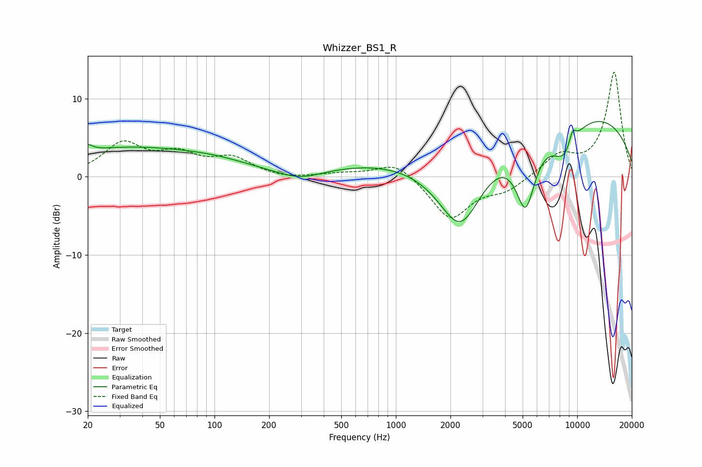

# Whizzer_BS1_R
See [usage instructions](https://github.com/jaakkopasanen/AutoEq#usage) for more options and info.

### Parametric EQs
Apply preamp of -7.2 dB when using parametric equalizer.

|   # | Type    |   Fc (Hz) |    Q |   Gain (dB) |
|-----|---------|-----------|------|-------------|
|   1 | Peaking |        20 | 5.66 |         0.8 |
|   2 | Peaking |        33 | 0.32 |         3.6 |
|   3 | Peaking |       105 | 0.75 |         0.7 |
|   4 | Peaking |       296 | 1.15 |        -1.3 |
|   5 | Peaking |      1277 | 0.29 |         1.9 |
|   6 | Peaking |      2273 | 0.93 |       -12.7 |
|   7 | Peaking |      5191 | 2.42 |        -9   |
|   8 | Peaking |      8105 | 0.19 |         8.9 |
|   9 | Peaking |      8515 | 1.76 |        -4.7 |
|  10 | Peaking |      9421 | 5.89 |         2   |

### Fixed Band EQs
When using fixed band (also called graphic) equalizer, apply preamp of **-13.5 dB** (if available) and set gains manually with these parameters.

|   # | Type    |   Fc (Hz) |    Q |   Gain (dB) |
|-----|---------|-----------|------|-------------|
|   1 | Peaking |        31 | 1.41 |         4   |
|   2 | Peaking |        62 | 1.41 |         2.5 |
|   3 | Peaking |       125 | 1.41 |         2.2 |
|   4 | Peaking |       250 | 1.41 |        -0.3 |
|   5 | Peaking |       500 | 1.41 |         0.4 |
|   6 | Peaking |      1000 | 1.41 |         2.1 |
|   7 | Peaking |      2000 | 1.41 |        -5.4 |
|   8 | Peaking |      4000 | 1.41 |        -1.6 |
|   9 | Peaking |      8000 | 1.41 |         2.6 |
|  10 | Peaking |     16000 | 1.41 |        13.4 |

### Graphs

