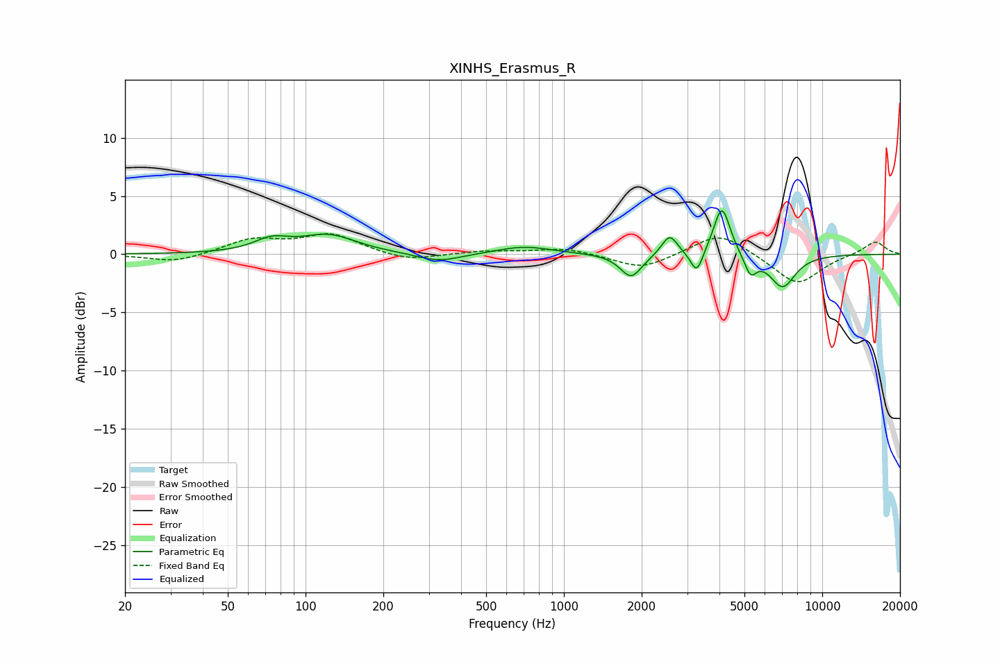

# XINHS_Erasmus_R
See [usage instructions](https://github.com/jaakkopasanen/AutoEq#usage) for more options and info.

### Parametric EQs
Apply preamp of -3.8 dB when using parametric equalizer.

|   # | Type    |   Fc (Hz) |    Q |   Gain (dB) |
|-----|---------|-----------|------|-------------|
|   1 | Peaking |        74 | 2.08 |         1   |
|   2 | Peaking |       123 | 1.31 |         1.6 |
|   3 | Peaking |       328 | 1.64 |        -0.7 |
|   4 | Peaking |       703 | 1.35 |         0.7 |
|   5 | Peaking |      1820 | 3.37 |        -2   |
|   6 | Peaking |      2565 | 4.64 |         1.8 |
|   7 | Peaking |      3267 | 5.96 |        -2   |
|   8 | Peaking |      4090 | 4.42 |         4.3 |
|   9 | Peaking |      5272 | 5.94 |        -1.7 |
|  10 | Peaking |      7019 | 2.7  |        -2.8 |

### Fixed Band EQs
When using fixed band (also called graphic) equalizer, apply preamp of **-1.9 dB** (if available) and set gains manually with these parameters.

|   # | Type    |   Fc (Hz) |    Q |   Gain (dB) |
|-----|---------|-----------|------|-------------|
|   1 | Peaking |        31 | 1.41 |        -0.7 |
|   2 | Peaking |        62 | 1.41 |         1.2 |
|   3 | Peaking |       125 | 1.41 |         1.6 |
|   4 | Peaking |       250 | 1.41 |        -0.6 |
|   5 | Peaking |       500 | 1.41 |         0.3 |
|   6 | Peaking |      1000 | 1.41 |         0.5 |
|   7 | Peaking |      2000 | 1.41 |        -1.3 |
|   8 | Peaking |      4000 | 1.41 |         2   |
|   9 | Peaking |      8000 | 1.41 |        -2.7 |
|  10 | Peaking |     16000 | 1.41 |         1.2 |

### Graphs

