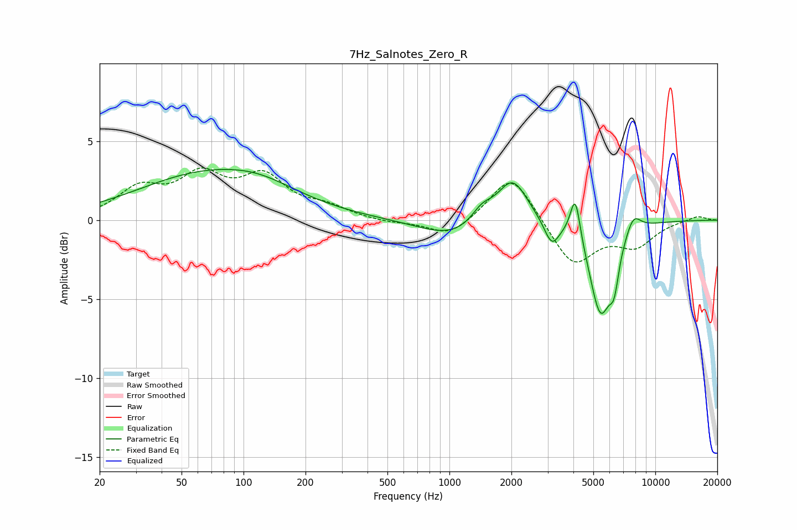

# 7Hz_Salnotes_Zero_R
See [usage instructions](https://github.com/jaakkopasanen/AutoEq#usage) for more options and info.

### Parametric EQs
Apply preamp of -3.3 dB when using parametric equalizer.

|   # | Type    |   Fc (Hz) |    Q |   Gain (dB) |
|-----|---------|-----------|------|-------------|
|   1 | Peaking |        69 | 0.41 |         2.9 |
|   2 | Peaking |       121 | 0.9  |         0.5 |
|   3 | Peaking |      1040 | 0.9  |        -1.1 |
|   4 | Peaking |      1439 | 2.69 |         0.9 |
|   5 | Peaking |      2024 | 1.93 |         2.8 |
|   6 | Peaking |      3141 | 3.88 |        -1.5 |
|   7 | Peaking |      4086 | 5.88 |         2.8 |
|   8 | Peaking |      5421 | 2.54 |        -5.8 |
|   9 | Peaking |      6315 | 6    |        -2   |
|  10 | Peaking |      7824 | 3.69 |         1.1 |

### Fixed Band EQs
When using fixed band (also called graphic) equalizer, apply preamp of **-3.4 dB** (if available) and set gains manually with these parameters.

|   # | Type    |   Fc (Hz) |    Q |   Gain (dB) |
|-----|---------|-----------|------|-------------|
|   1 | Peaking |        31 | 1.41 |         1.8 |
|   2 | Peaking |        62 | 1.41 |         2.5 |
|   3 | Peaking |       125 | 1.41 |         2.5 |
|   4 | Peaking |       250 | 1.41 |         0.7 |
|   5 | Peaking |       500 | 1.41 |        -0.2 |
|   6 | Peaking |      1000 | 1.41 |        -1.1 |
|   7 | Peaking |      2000 | 1.41 |         3.1 |
|   8 | Peaking |      4000 | 1.41 |        -2.9 |
|   9 | Peaking |      8000 | 1.41 |        -1.5 |
|  10 | Peaking |     16000 | 1.41 |         0.3 |

### Graphs

