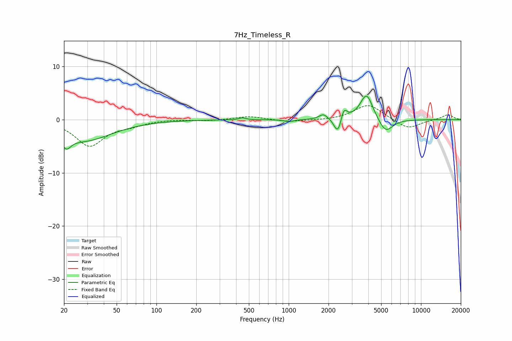

# 7Hz_Timeless_R
See [usage instructions](https://github.com/jaakkopasanen/AutoEq#usage) for more options and info.

### Parametric EQs
Apply preamp of -4.5 dB when using parametric equalizer.

|   # | Type    |   Fc (Hz) |    Q |   Gain (dB) |
|-----|---------|-----------|------|-------------|
|   1 | Peaking |        21 | 4.06 |        -2.3 |
|   2 | Peaking |        28 | 0.68 |        -3.9 |
|   3 | Peaking |       447 | 5.95 |         0.4 |
|   4 | Peaking |      1004 | 3.92 |        -0.4 |
|   5 | Peaking |      1826 | 4.66 |         1   |
|   6 | Peaking |      2275 | 5.98 |        -1.2 |
|   7 | Peaking |      2395 | 5.99 |        -2.2 |
|   8 | Peaking |      2603 | 5.98 |         2.3 |
|   9 | Peaking |      3878 | 2.93 |         5   |
|  10 | Peaking |      5398 | 2.62 |        -2.7 |

### Fixed Band EQs
When using fixed band (also called graphic) equalizer, apply preamp of **-2.7 dB** (if available) and set gains manually with these parameters.

|   # | Type    |   Fc (Hz) |    Q |   Gain (dB) |
|-----|---------|-----------|------|-------------|
|   1 | Peaking |        31 | 1.41 |        -4.9 |
|   2 | Peaking |        62 | 1.41 |        -0.8 |
|   3 | Peaking |       125 | 1.41 |         0.1 |
|   4 | Peaking |       250 | 1.41 |        -0.2 |
|   5 | Peaking |       500 | 1.41 |         0.7 |
|   6 | Peaking |      1000 | 1.41 |        -0.4 |
|   7 | Peaking |      2000 | 1.41 |        -0.1 |
|   8 | Peaking |      4000 | 1.41 |         2.9 |
|   9 | Peaking |      8000 | 1.41 |        -1.8 |
|  10 | Peaking |     16000 | 1.41 |         1   |

### Graphs

