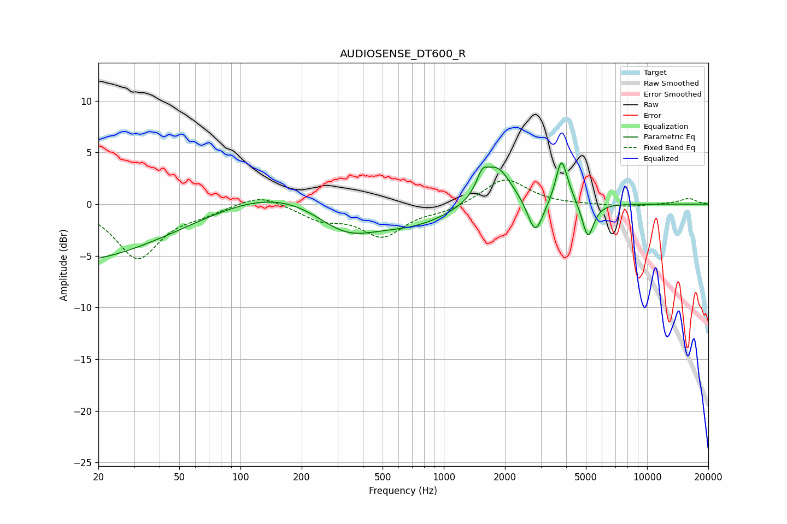

# AUDIOSENSE_DT600_R
See [usage instructions](https://github.com/jaakkopasanen/AutoEq#usage) for more options and info.

### Parametric EQs
Apply preamp of -4.1 dB when using parametric equalizer.

|   # | Type    |   Fc (Hz) |    Q |   Gain (dB) |
|-----|---------|-----------|------|-------------|
|   1 | Peaking |        20 | 0.22 |        -6.5 |
|   2 | Peaking |       105 | 0.26 |         3.5 |
|   3 | Peaking |       330 | 0.83 |        -3.7 |
|   4 | Peaking |       711 | 0.74 |        -1.9 |
|   5 | Peaking |      1543 | 5.43 |         1.4 |
|   6 | Peaking |      1816 | 1.91 |         3.9 |
|   7 | Peaking |      2821 | 3.81 |        -3.4 |
|   8 | Peaking |      3776 | 5.6  |         3.4 |
|   9 | Peaking |      3962 | 3.36 |         1.3 |
|  10 | Peaking |      5118 | 4.99 |        -3.5 |

### Fixed Band EQs
When using fixed band (also called graphic) equalizer, apply preamp of **-2.4 dB** (if available) and set gains manually with these parameters.

|   # | Type    |   Fc (Hz) |    Q |   Gain (dB) |
|-----|---------|-----------|------|-------------|
|   1 | Peaking |        31 | 1.41 |        -5.2 |
|   2 | Peaking |        62 | 1.41 |        -0.7 |
|   3 | Peaking |       125 | 1.41 |         1.1 |
|   4 | Peaking |       250 | 1.41 |        -1.3 |
|   5 | Peaking |       500 | 1.41 |        -3   |
|   6 | Peaking |      1000 | 1.41 |        -0.6 |
|   7 | Peaking |      2000 | 1.41 |         2.6 |
|   8 | Peaking |      4000 | 1.41 |        -0   |
|   9 | Peaking |      8000 | 1.41 |        -0.3 |
|  10 | Peaking |     16000 | 1.41 |         0.6 |

### Graphs

