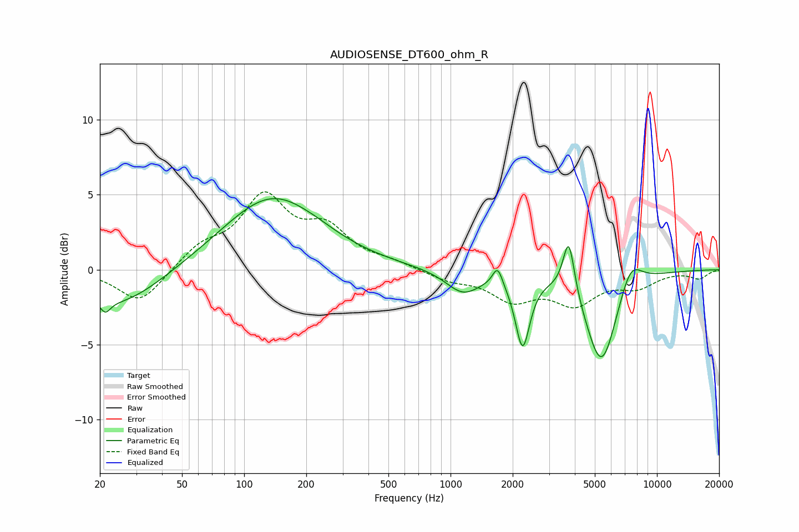

# AUDIOSENSE_DT600_ohm_R
See [usage instructions](https://github.com/jaakkopasanen/AutoEq#usage) for more options and info.

### Parametric EQs
Apply preamp of -4.8 dB when using parametric equalizer.

|   # | Type    |   Fc (Hz) |    Q |   Gain (dB) |
|-----|---------|-----------|------|-------------|
|   1 | Peaking |        21 | 5.66 |        -0.8 |
|   2 | Peaking |        25 | 0.69 |        -2.5 |
|   3 | Peaking |       137 | 0.6  |         4.9 |
|   4 | Peaking |       231 | 2.35 |         0   |
|   5 | Peaking |      1149 | 1.69 |        -1.5 |
|   6 | Peaking |      1690 | 6    |         1.3 |
|   7 | Peaking |      2234 | 4.1  |        -4.7 |
|   8 | Peaking |      3739 | 5.1  |         3.8 |
|   9 | Peaking |      5383 | 1.82 |        -6.4 |
|  10 | Peaking |      7438 | 2.44 |         1.9 |

### Fixed Band EQs
When using fixed band (also called graphic) equalizer, apply preamp of **-5.3 dB** (if available) and set gains manually with these parameters.

|   # | Type    |   Fc (Hz) |    Q |   Gain (dB) |
|-----|---------|-----------|------|-------------|
|   1 | Peaking |        31 | 1.41 |        -2.3 |
|   2 | Peaking |        62 | 1.41 |         1.4 |
|   3 | Peaking |       125 | 1.41 |         4.6 |
|   4 | Peaking |       250 | 1.41 |         2.4 |
|   5 | Peaking |       500 | 1.41 |         0.4 |
|   6 | Peaking |      1000 | 1.41 |        -0.6 |
|   7 | Peaking |      2000 | 1.41 |        -1.8 |
|   8 | Peaking |      4000 | 1.41 |        -2.1 |
|   9 | Peaking |      8000 | 1.41 |        -1   |
|  10 | Peaking |     16000 | 1.41 |        -0.6 |

### Graphs

