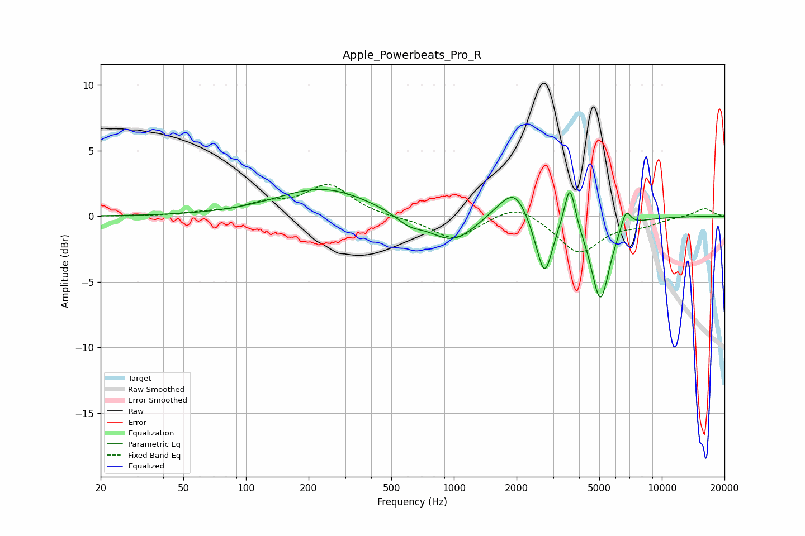

# Apple_Powerbeats_Pro_R
See [usage instructions](https://github.com/jaakkopasanen/AutoEq#usage) for more options and info.

### Parametric EQs
Apply preamp of -2.1 dB when using parametric equalizer.

|   # | Type    |   Fc (Hz) |    Q |   Gain (dB) |
|-----|---------|-----------|------|-------------|
|   1 | Peaking |       234 | 0.64 |         2.1 |
|   2 | Peaking |       609 | 2.18 |        -0.8 |
|   3 | Peaking |       984 | 1.27 |        -2.1 |
|   4 | Peaking |      1677 | 1.67 |         0.6 |
|   5 | Peaking |      1972 | 2.23 |         2   |
|   6 | Peaking |      2533 | 3.09 |        -0.9 |
|   7 | Peaking |      2740 | 4.02 |        -3.9 |
|   8 | Peaking |      3609 | 5.57 |         3.4 |
|   9 | Peaking |      5058 | 3.15 |        -6.4 |
|  10 | Peaking |      6714 | 5.94 |         1.5 |

### Fixed Band EQs
When using fixed band (also called graphic) equalizer, apply preamp of **-2.5 dB** (if available) and set gains manually with these parameters.

|   # | Type    |   Fc (Hz) |    Q |   Gain (dB) |
|-----|---------|-----------|------|-------------|
|   1 | Peaking |        31 | 1.41 |        -0   |
|   2 | Peaking |        62 | 1.41 |         0.2 |
|   3 | Peaking |       125 | 1.41 |         0.8 |
|   4 | Peaking |       250 | 1.41 |         2.3 |
|   5 | Peaking |       500 | 1.41 |        -0.1 |
|   6 | Peaking |      1000 | 1.41 |        -1.8 |
|   7 | Peaking |      2000 | 1.41 |         1.1 |
|   8 | Peaking |      4000 | 1.41 |        -2.8 |
|   9 | Peaking |      8000 | 1.41 |        -0.5 |
|  10 | Peaking |     16000 | 1.41 |         0.6 |

### Graphs

