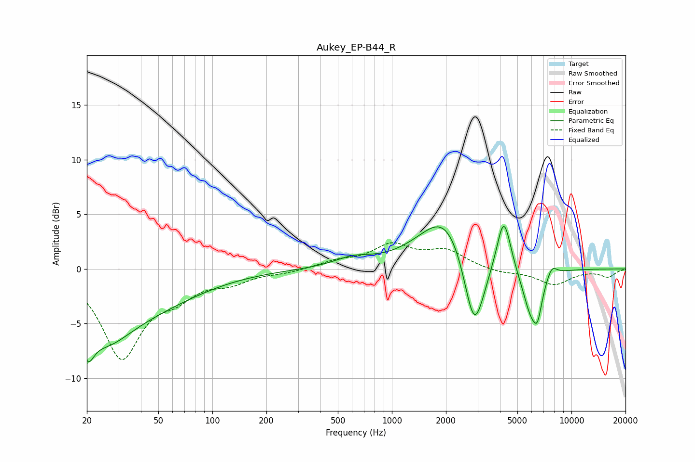

# Aukey_EP-B44_R
See [usage instructions](https://github.com/jaakkopasanen/AutoEq#usage) for more options and info.

### Parametric EQs
Apply preamp of -4.0 dB when using parametric equalizer.

|   # | Type    |   Fc (Hz) |    Q |   Gain (dB) |
|-----|---------|-----------|------|-------------|
|   1 | Peaking |        20 | 4.39 |        -2.4 |
|   2 | Peaking |        25 | 0.34 |        -4.6 |
|   3 | Peaking |        26 | 1.16 |        -2.1 |
|   4 | Peaking |       605 | 1.35 |         0.8 |
|   5 | Peaking |      2032 | 0.96 |         5.5 |
|   6 | Peaking |      2874 | 2.3  |        -8.2 |
|   7 | Peaking |      4199 | 3.6  |         5.1 |
|   8 | Peaking |      5995 | 2.63 |        -4.4 |
|   9 | Peaking |      6479 | 5.93 |        -2   |
|  10 | Peaking |      7759 | 4.55 |         1.1 |

### Fixed Band EQs
When using fixed band (also called graphic) equalizer, apply preamp of **-2.5 dB** (if available) and set gains manually with these parameters.

|   # | Type    |   Fc (Hz) |    Q |   Gain (dB) |
|-----|---------|-----------|------|-------------|
|   1 | Peaking |        31 | 1.41 |        -7.9 |
|   2 | Peaking |        62 | 1.41 |        -1.9 |
|   3 | Peaking |       125 | 1.41 |        -1   |
|   4 | Peaking |       250 | 1.41 |        -0.3 |
|   5 | Peaking |       500 | 1.41 |         0.6 |
|   6 | Peaking |      1000 | 1.41 |         2   |
|   7 | Peaking |      2000 | 1.41 |         1.6 |
|   8 | Peaking |      4000 | 1.41 |        -0.4 |
|   9 | Peaking |      8000 | 1.41 |        -1.4 |
|  10 | Peaking |     16000 | 1.41 |        -0.7 |

### Graphs

