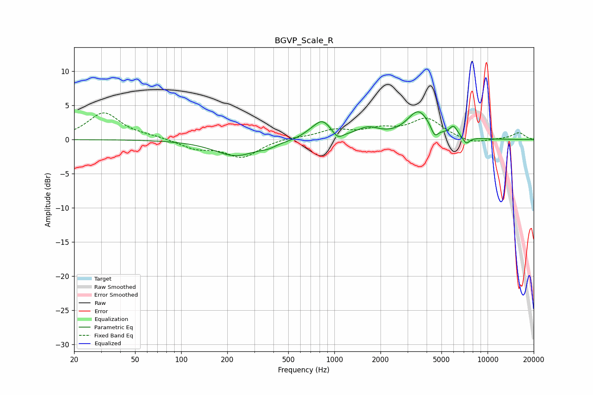

# BGVP_Scale_R
See [usage instructions](https://github.com/jaakkopasanen/AutoEq#usage) for more options and info.

### Parametric EQs
Apply preamp of -4.2 dB when using parametric equalizer.

|   # | Type    |   Fc (Hz) |    Q |   Gain (dB) |
|-----|---------|-----------|------|-------------|
|   1 | Peaking |       227 | 1.02 |        -2.4 |
|   2 | Peaking |       370 | 2.85 |        -0.5 |
|   3 | Peaking |       679 | 2.96 |         0.3 |
|   4 | Peaking |       833 | 2.35 |         2.7 |
|   5 | Peaking |      1050 | 4.26 |        -1.1 |
|   6 | Peaking |      1659 | 1.9  |         1.4 |
|   7 | Peaking |      3540 | 1.9  |         4   |
|   8 | Peaking |      4513 | 6    |        -1.5 |
|   9 | Peaking |      5997 | 5.27 |         1.5 |
|  10 | Peaking |      7258 | 6    |        -1   |

### Fixed Band EQs
When using fixed band (also called graphic) equalizer, apply preamp of **-4.0 dB** (if available) and set gains manually with these parameters.

|   # | Type    |   Fc (Hz) |    Q |   Gain (dB) |
|-----|---------|-----------|------|-------------|
|   1 | Peaking |        31 | 1.41 |         3.9 |
|   2 | Peaking |        62 | 1.41 |         0.4 |
|   3 | Peaking |       125 | 1.41 |        -1.2 |
|   4 | Peaking |       250 | 1.41 |        -2.5 |
|   5 | Peaking |       500 | 1.41 |         0.3 |
|   6 | Peaking |      1000 | 1.41 |         1.3 |
|   7 | Peaking |      2000 | 1.41 |         1.3 |
|   8 | Peaking |      4000 | 1.41 |         3   |
|   9 | Peaking |      8000 | 1.41 |        -0.7 |
|  10 | Peaking |     16000 | 1.41 |         1   |

### Graphs

