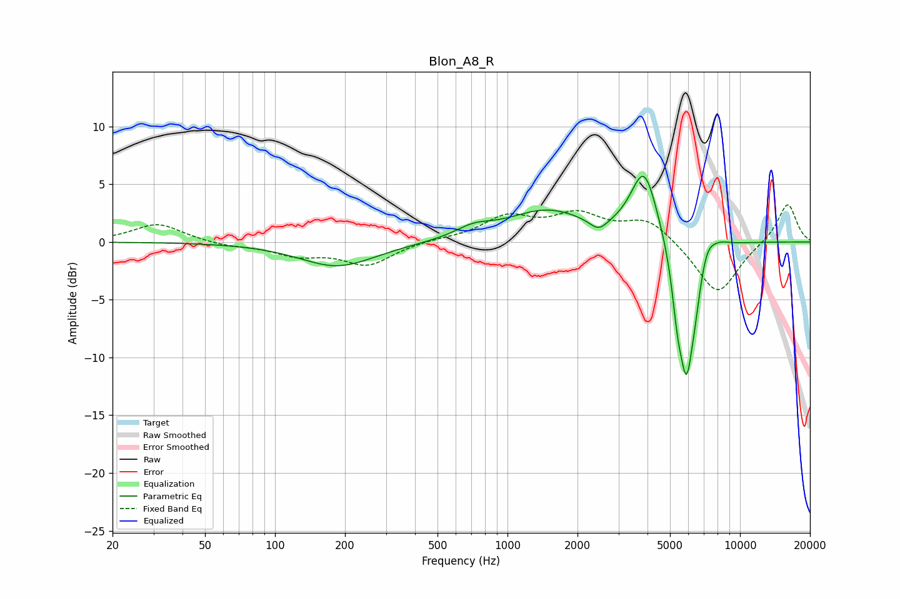

# Blon_A8_R
See [usage instructions](https://github.com/jaakkopasanen/AutoEq#usage) for more options and info.

### Parametric EQs
Apply preamp of -5.8 dB when using parametric equalizer.

|   # | Type    |   Fc (Hz) |    Q |   Gain (dB) |
|-----|---------|-----------|------|-------------|
|   1 | Peaking |       186 | 0.87 |        -2.1 |
|   2 | Peaking |       713 | 1.81 |         0.8 |
|   3 | Peaking |      1471 | 0.82 |         2.6 |
|   4 | Peaking |      2466 | 3.63 |        -1   |
|   5 | Peaking |      3871 | 2.41 |         6.2 |
|   6 | Peaking |      5376 | 6    |        -3.4 |
|   7 | Peaking |      5891 | 4.01 |       -11   |
|   8 | Peaking |      6429 | 6    |        -1.6 |
|   9 | Peaking |      7222 | 4.67 |         1.2 |
|  10 | Peaking |      8038 | 2.87 |         0.6 |

### Fixed Band EQs
When using fixed band (also called graphic) equalizer, apply preamp of **-3.3 dB** (if available) and set gains manually with these parameters.

|   # | Type    |   Fc (Hz) |    Q |   Gain (dB) |
|-----|---------|-----------|------|-------------|
|   1 | Peaking |        31 | 1.41 |         1.6 |
|   2 | Peaking |        62 | 1.41 |        -0.3 |
|   3 | Peaking |       125 | 1.41 |        -1   |
|   4 | Peaking |       250 | 1.41 |        -1.9 |
|   5 | Peaking |       500 | 1.41 |         0.2 |
|   6 | Peaking |      1000 | 1.41 |         2   |
|   7 | Peaking |      2000 | 1.41 |         2.1 |
|   8 | Peaking |      4000 | 1.41 |         2   |
|   9 | Peaking |      8000 | 1.41 |        -4.7 |
|  10 | Peaking |     16000 | 1.41 |         3.4 |

### Graphs

