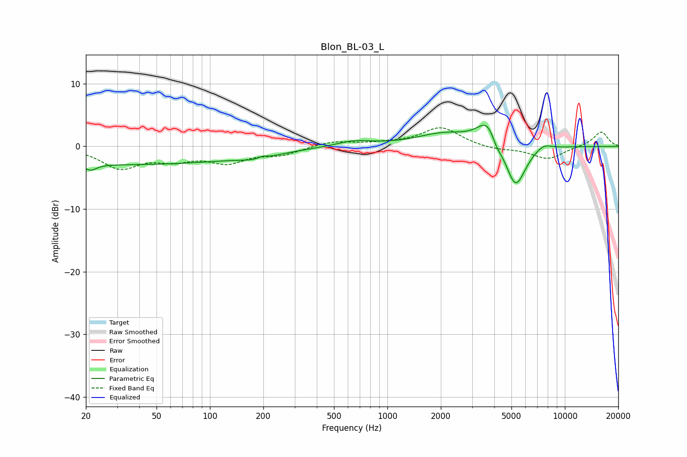

# Blon_BL-03_L
See [usage instructions](https://github.com/jaakkopasanen/AutoEq#usage) for more options and info.

### Parametric EQs
Apply preamp of -3.5 dB when using parametric equalizer.

|   # | Type    |   Fc (Hz) |    Q |   Gain (dB) |
|-----|---------|-----------|------|-------------|
|   1 | Peaking |        21 | 4.34 |        -1   |
|   2 | Peaking |        33 | 0.18 |        -2.9 |
|   3 | Peaking |       187 | 1.44 |        -0.8 |
|   4 | Peaking |       198 | 5.37 |         0.4 |
|   5 | Peaking |       650 | 1.42 |         0.9 |
|   6 | Peaking |      2097 | 0.9  |         2   |
|   7 | Peaking |      3707 | 2.29 |         4.4 |
|   8 | Peaking |      4114 | 4.79 |        -1.5 |
|   9 | Peaking |      5267 | 2.43 |        -7.2 |
|  10 | Peaking |      7577 | 2.89 |         0.9 |

### Fixed Band EQs
When using fixed band (also called graphic) equalizer, apply preamp of **-3.1 dB** (if available) and set gains manually with these parameters.

|   # | Type    |   Fc (Hz) |    Q |   Gain (dB) |
|-----|---------|-----------|------|-------------|
|   1 | Peaking |        31 | 1.41 |        -3.3 |
|   2 | Peaking |        62 | 1.41 |        -1.7 |
|   3 | Peaking |       125 | 1.41 |        -2.3 |
|   4 | Peaking |       250 | 1.41 |        -1.2 |
|   5 | Peaking |       500 | 1.41 |         0.8 |
|   6 | Peaking |      1000 | 1.41 |         0.4 |
|   7 | Peaking |      2000 | 1.41 |         3   |
|   8 | Peaking |      4000 | 1.41 |        -0.5 |
|   9 | Peaking |      8000 | 1.41 |        -2   |
|  10 | Peaking |     16000 | 1.41 |         2.4 |

### Graphs

