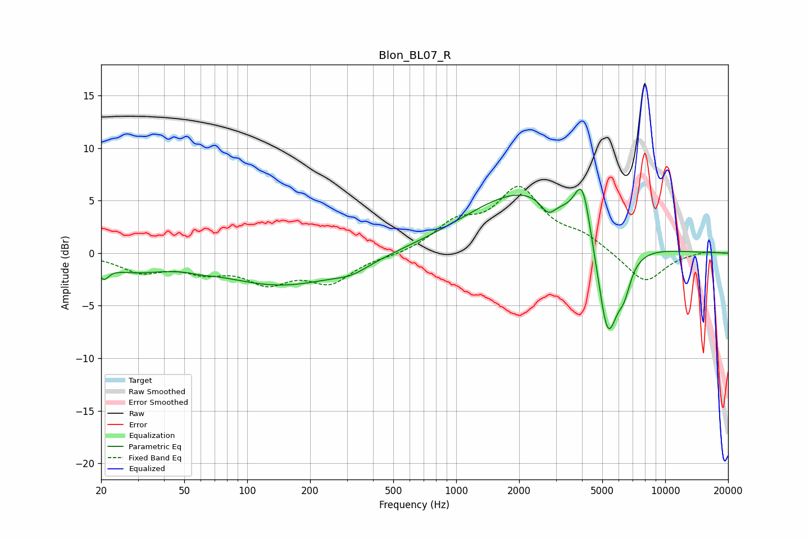

# Blon_BL07_R
See [usage instructions](https://github.com/jaakkopasanen/AutoEq#usage) for more options and info.

### Parametric EQs
Apply preamp of -6.2 dB when using parametric equalizer.

|   # | Type    |   Fc (Hz) |    Q |   Gain (dB) |
|-----|---------|-----------|------|-------------|
|   1 | Peaking |        21 | 5.91 |        -1.3 |
|   2 | Peaking |        28 | 0.93 |        -1.3 |
|   3 | Peaking |        61 | 2.78 |        -0.2 |
|   4 | Peaking |       149 | 0.48 |        -3   |
|   5 | Peaking |       316 | 1.75 |        -0.7 |
|   6 | Peaking |      2150 | 0.5  |         6   |
|   7 | Peaking |      2752 | 3.93 |        -1.4 |
|   8 | Peaking |      4026 | 3.57 |         5.2 |
|   9 | Peaking |      5309 | 2.62 |       -10.1 |
|  10 | Peaking |      6366 | 4.28 |        -2.3 |

### Fixed Band EQs
When using fixed band (also called graphic) equalizer, apply preamp of **-6.4 dB** (if available) and set gains manually with these parameters.

|   # | Type    |   Fc (Hz) |    Q |   Gain (dB) |
|-----|---------|-----------|------|-------------|
|   1 | Peaking |        31 | 1.41 |        -1.6 |
|   2 | Peaking |        62 | 1.41 |        -1.4 |
|   3 | Peaking |       125 | 1.41 |        -2.4 |
|   4 | Peaking |       250 | 1.41 |        -2.6 |
|   5 | Peaking |       500 | 1.41 |        -0.3 |
|   6 | Peaking |      1000 | 1.41 |         2.5 |
|   7 | Peaking |      2000 | 1.41 |         5.8 |
|   8 | Peaking |      4000 | 1.41 |         1.4 |
|   9 | Peaking |      8000 | 1.41 |        -2.9 |
|  10 | Peaking |     16000 | 1.41 |         0.2 |

### Graphs

