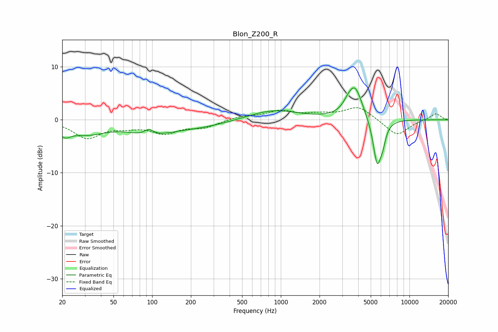

# Blon_Z200_R
See [usage instructions](https://github.com/jaakkopasanen/AutoEq#usage) for more options and info.

### Parametric EQs
Apply preamp of -6.1 dB when using parametric equalizer.

|   # | Type    |   Fc (Hz) |    Q |   Gain (dB) |
|-----|---------|-----------|------|-------------|
|   1 | Peaking |        21 | 3.24 |        -1.7 |
|   2 | Peaking |        31 | 0.89 |        -2.4 |
|   3 | Peaking |        94 | 1.04 |        -2   |
|   4 | Peaking |        94 | 3.53 |         1.3 |
|   5 | Peaking |       199 | 0.5  |        -1.5 |
|   6 | Peaking |       868 | 0.72 |         1.9 |
|   7 | Peaking |      3333 | 3.82 |         0.9 |
|   8 | Peaking |      3775 | 2.44 |         6   |
|   9 | Peaking |      5610 | 4.18 |        -8.7 |
|  10 | Peaking |      6199 | 6    |        -2.3 |

### Fixed Band EQs
When using fixed band (also called graphic) equalizer, apply preamp of **-2.4 dB** (if available) and set gains manually with these parameters.

|   # | Type    |   Fc (Hz) |    Q |   Gain (dB) |
|-----|---------|-----------|------|-------------|
|   1 | Peaking |        31 | 1.41 |        -3.3 |
|   2 | Peaking |        62 | 1.41 |        -1   |
|   3 | Peaking |       125 | 1.41 |        -2.3 |
|   4 | Peaking |       250 | 1.41 |        -1.3 |
|   5 | Peaking |       500 | 1.41 |         0.6 |
|   6 | Peaking |      1000 | 1.41 |         1.6 |
|   7 | Peaking |      2000 | 1.41 |         0.8 |
|   8 | Peaking |      4000 | 1.41 |         2.5 |
|   9 | Peaking |      8000 | 1.41 |        -3.1 |
|  10 | Peaking |     16000 | 1.41 |         1.2 |

### Graphs

