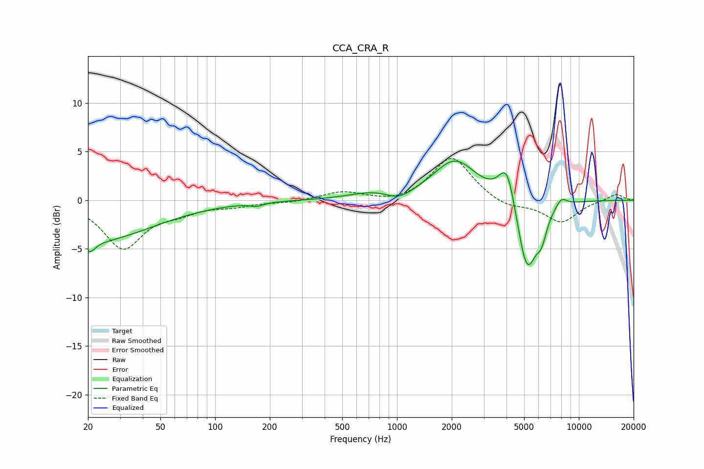

# CCA_CRA_R
See [usage instructions](https://github.com/jaakkopasanen/AutoEq#usage) for more options and info.

### Parametric EQs
Apply preamp of -4.1 dB when using parametric equalizer.

|   # | Type    |   Fc (Hz) |    Q |   Gain (dB) |
|-----|---------|-----------|------|-------------|
|   1 | Peaking |        20 | 0.41 |        -4.3 |
|   2 | Peaking |        21 | 5    |        -1   |
|   3 | Peaking |       169 | 4.1  |        -0.3 |
|   4 | Peaking |       742 | 1.12 |         0.7 |
|   5 | Peaking |      1021 | 1.97 |        -0.9 |
|   6 | Peaking |      2086 | 1.19 |         4.1 |
|   7 | Peaking |      4027 | 3.09 |         4.3 |
|   8 | Peaking |      5183 | 2.49 |        -7.8 |
|   9 | Peaking |      6239 | 4.85 |        -2.1 |
|  10 | Peaking |      7993 | 4.15 |         1   |

### Fixed Band EQs
When using fixed band (also called graphic) equalizer, apply preamp of **-4.4 dB** (if available) and set gains manually with these parameters.

|   # | Type    |   Fc (Hz) |    Q |   Gain (dB) |
|-----|---------|-----------|------|-------------|
|   1 | Peaking |        31 | 1.41 |        -4.9 |
|   2 | Peaking |        62 | 1.41 |        -1   |
|   3 | Peaking |       125 | 1.41 |        -0.5 |
|   4 | Peaking |       250 | 1.41 |        -0.2 |
|   5 | Peaking |       500 | 1.41 |         0.9 |
|   6 | Peaking |      1000 | 1.41 |        -0.4 |
|   7 | Peaking |      2000 | 1.41 |         4.5 |
|   8 | Peaking |      4000 | 1.41 |        -0.8 |
|   9 | Peaking |      8000 | 1.41 |        -2.3 |
|  10 | Peaking |     16000 | 1.41 |         0.7 |

### Graphs

