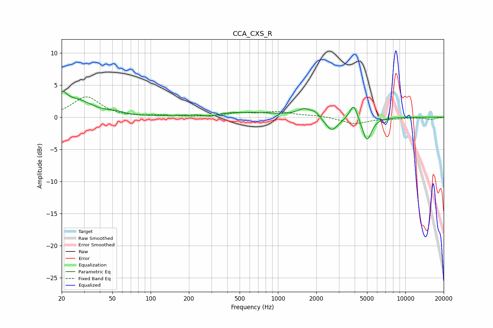

# CCA_CXS_R
See [usage instructions](https://github.com/jaakkopasanen/AutoEq#usage) for more options and info.

### Parametric EQs
Apply preamp of -4.1 dB when using parametric equalizer.

|   # | Type    |   Fc (Hz) |    Q |   Gain (dB) |
|-----|---------|-----------|------|-------------|
|   1 | Peaking |        20 | 4.55 |         1.9 |
|   2 | Peaking |        25 | 1.07 |         2.6 |
|   3 | Peaking |        53 | 2.68 |         0.3 |
|   4 | Peaking |       295 | 3.21 |        -0.4 |
|   5 | Peaking |       512 | 0.5  |         0.8 |
|   6 | Peaking |      1620 | 2.56 |         1.2 |
|   7 | Peaking |      1969 | 4.51 |         0.6 |
|   8 | Peaking |      2643 | 2.78 |        -2.3 |
|   9 | Peaking |      3926 | 4.59 |         2.5 |
|  10 | Peaking |      4995 | 3.92 |        -3.7 |

### Fixed Band EQs
When using fixed band (also called graphic) equalizer, apply preamp of **-3.2 dB** (if available) and set gains manually with these parameters.

|   # | Type    |   Fc (Hz) |    Q |   Gain (dB) |
|-----|---------|-----------|------|-------------|
|   1 | Peaking |        31 | 1.41 |         3.1 |
|   2 | Peaking |        62 | 1.41 |        -0.1 |
|   3 | Peaking |       125 | 1.41 |         0.2 |
|   4 | Peaking |       250 | 1.41 |         0   |
|   5 | Peaking |       500 | 1.41 |         0.6 |
|   6 | Peaking |      1000 | 1.41 |         0.8 |
|   7 | Peaking |      2000 | 1.41 |         0.2 |
|   8 | Peaking |      4000 | 1.41 |        -1   |
|   9 | Peaking |      8000 | 1.41 |        -0.2 |
|  10 | Peaking |     16000 | 1.41 |        -0.3 |

### Graphs

