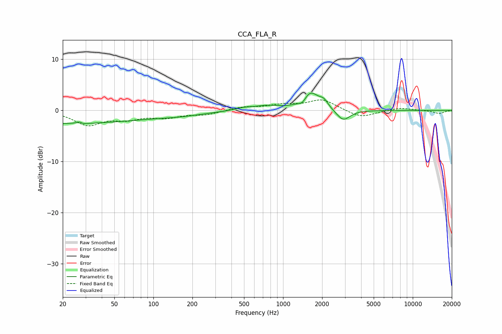

# CCA_FLA_R
See [usage instructions](https://github.com/jaakkopasanen/AutoEq#usage) for more options and info.

### Parametric EQs
Apply preamp of -3.5 dB when using parametric equalizer.

|   # | Type    |   Fc (Hz) |    Q |   Gain (dB) |
|-----|---------|-----------|------|-------------|
|   1 | Peaking |        20 | 0.22 |        -2.5 |
|   2 | Peaking |        27 | 5.54 |         2.5 |
|   3 | Peaking |        28 | 5.3  |        -2.3 |
|   4 | Peaking |       160 | 0.71 |        -0.6 |
|   5 | Peaking |       498 | 2    |         0.5 |
|   6 | Peaking |       762 | 1.44 |         0.8 |
|   7 | Peaking |      1410 | 5.47 |        -0.9 |
|   8 | Peaking |      1628 | 2.31 |         3.4 |
|   9 | Peaking |      2061 | 4.3  |         1.3 |
|  10 | Peaking |      2909 | 2.74 |        -2.2 |

### Fixed Band EQs
When using fixed band (also called graphic) equalizer, apply preamp of **-2.1 dB** (if available) and set gains manually with these parameters.

|   # | Type    |   Fc (Hz) |    Q |   Gain (dB) |
|-----|---------|-----------|------|-------------|
|   1 | Peaking |        31 | 1.41 |        -2.7 |
|   2 | Peaking |        62 | 1.41 |        -1.4 |
|   3 | Peaking |       125 | 1.41 |        -1.2 |
|   4 | Peaking |       250 | 1.41 |        -0.8 |
|   5 | Peaking |       500 | 1.41 |         0.7 |
|   6 | Peaking |      1000 | 1.41 |         1   |
|   7 | Peaking |      2000 | 1.41 |         2.1 |
|   8 | Peaking |      4000 | 1.41 |        -1.5 |
|   9 | Peaking |      8000 | 1.41 |         0.5 |
|  10 | Peaking |     16000 | 1.41 |        -0.6 |

### Graphs

