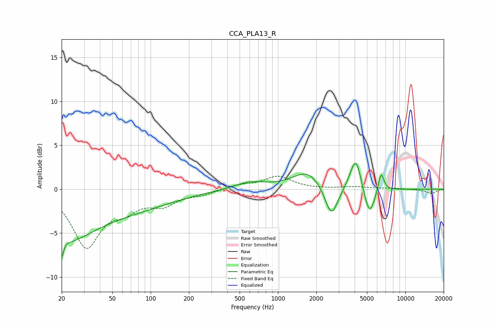

# CCA_PLA13_R
See [usage instructions](https://github.com/jaakkopasanen/AutoEq#usage) for more options and info.

### Parametric EQs
Apply preamp of -3.0 dB when using parametric equalizer.

|   # | Type    |   Fc (Hz) |    Q |   Gain (dB) |
|-----|---------|-----------|------|-------------|
|   1 | Peaking |        20 | 0.62 |        -4.9 |
|   2 | Peaking |        20 | 5.65 |        -4.9 |
|   3 | Peaking |        21 | 5.64 |         3.3 |
|   4 | Peaking |        63 | 0.38 |        -2   |
|   5 | Peaking |       605 | 1.13 |         0.8 |
|   6 | Peaking |      1701 | 1.23 |         2   |
|   7 | Peaking |      2626 | 2.74 |        -3.7 |
|   8 | Peaking |      4077 | 3.22 |         3.9 |
|   9 | Peaking |      5222 | 3.24 |        -3.4 |
|  10 | Peaking |      6447 | 6    |         2.3 |

### Fixed Band EQs
When using fixed band (also called graphic) equalizer, apply preamp of **-1.6 dB** (if available) and set gains manually with these parameters.

|   # | Type    |   Fc (Hz) |    Q |   Gain (dB) |
|-----|---------|-----------|------|-------------|
|   1 | Peaking |        31 | 1.41 |        -6.4 |
|   2 | Peaking |        62 | 1.41 |        -1.8 |
|   3 | Peaking |       125 | 1.41 |        -1.5 |
|   4 | Peaking |       250 | 1.41 |        -0.5 |
|   5 | Peaking |       500 | 1.41 |         0.5 |
|   6 | Peaking |      1000 | 1.41 |         1.4 |
|   7 | Peaking |      2000 | 1.41 |         0   |
|   8 | Peaking |      4000 | 1.41 |         0.3 |
|   9 | Peaking |      8000 | 1.41 |         0.1 |
|  10 | Peaking |     16000 | 1.41 |        -0.5 |

### Graphs

