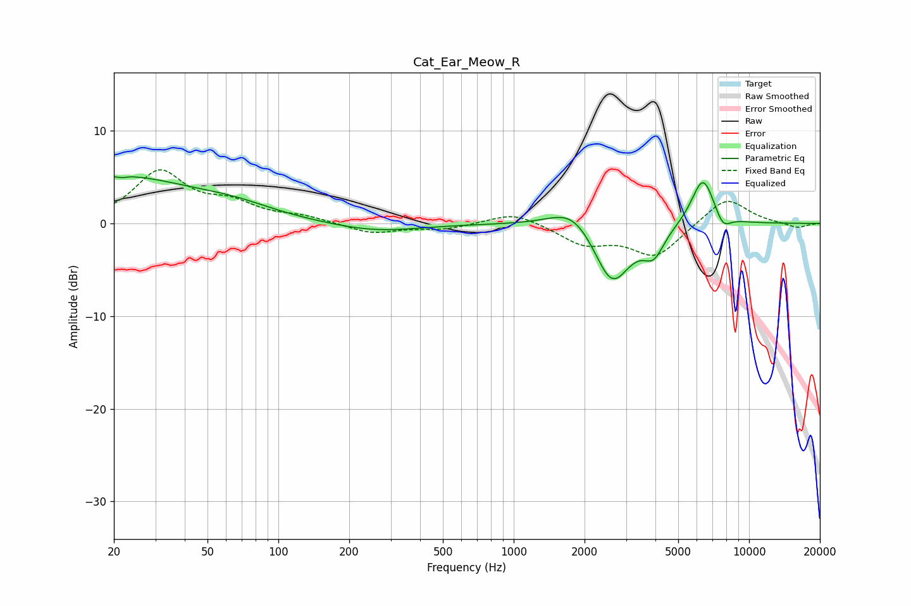

# Cat_Ear_Meow_R
See [usage instructions](https://github.com/jaakkopasanen/AutoEq#usage) for more options and info.

### Parametric EQs
Apply preamp of -5.1 dB when using parametric equalizer.

|   # | Type    |   Fc (Hz) |    Q |   Gain (dB) |
|-----|---------|-----------|------|-------------|
|   1 | Peaking |        20 | 0.42 |         5   |
|   2 | Peaking |        22 | 5.97 |        -2.7 |
|   3 | Peaking |        22 | 5.92 |         2.5 |
|   4 | Peaking |        65 | 0.83 |         1   |
|   5 | Peaking |       258 | 0.75 |        -0.9 |
|   6 | Peaking |      1793 | 1.46 |         2.5 |
|   7 | Peaking |      2614 | 1.79 |        -6.8 |
|   8 | Peaking |      3934 | 3.17 |        -2.7 |
|   9 | Peaking |      6369 | 2.77 |         5.3 |
|  10 | Peaking |      7740 | 4.15 |        -1.5 |

### Fixed Band EQs
When using fixed band (also called graphic) equalizer, apply preamp of **-5.9 dB** (if available) and set gains manually with these parameters.

|   # | Type    |   Fc (Hz) |    Q |   Gain (dB) |
|-----|---------|-----------|------|-------------|
|   1 | Peaking |        31 | 1.41 |         5.4 |
|   2 | Peaking |        62 | 1.41 |         1.8 |
|   3 | Peaking |       125 | 1.41 |         0.6 |
|   4 | Peaking |       250 | 1.41 |        -1.1 |
|   5 | Peaking |       500 | 1.41 |        -0.6 |
|   6 | Peaking |      1000 | 1.41 |         1.3 |
|   7 | Peaking |      2000 | 1.41 |        -2.1 |
|   8 | Peaking |      4000 | 1.41 |        -3.5 |
|   9 | Peaking |      8000 | 1.41 |         2.9 |
|  10 | Peaking |     16000 | 1.41 |        -0.5 |

### Graphs

