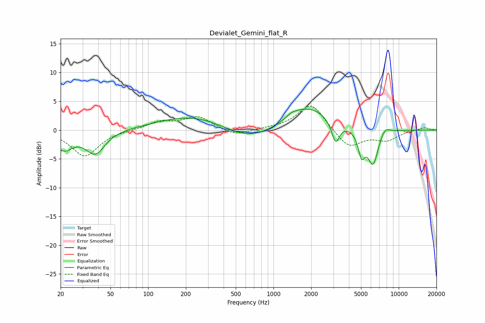

# Devialet_Gemini_flat_R
See [usage instructions](https://github.com/jaakkopasanen/AutoEq#usage) for more options and info.

### Parametric EQs
Apply preamp of -3.7 dB when using parametric equalizer.

|   # | Type    |   Fc (Hz) |    Q |   Gain (dB) |
|-----|---------|-----------|------|-------------|
|   1 | Peaking |        21 | 2.01 |        -3.1 |
|   2 | Peaking |        38 | 1.84 |        -4   |
|   3 | Peaking |       237 | 0.5  |         2.7 |
|   4 | Peaking |       624 | 0.66 |        -2.4 |
|   5 | Peaking |      1403 | 2.7  |         0.7 |
|   6 | Peaking |      1915 | 0.84 |         4.1 |
|   7 | Peaking |      3130 | 4.5  |        -3.8 |
|   8 | Peaking |      5046 | 5.13 |        -3.9 |
|   9 | Peaking |      6227 | 3.15 |        -6.1 |
|  10 | Peaking |      7725 | 3.37 |         1.4 |

### Fixed Band EQs
When using fixed band (also called graphic) equalizer, apply preamp of **-4.3 dB** (if available) and set gains manually with these parameters.

|   # | Type    |   Fc (Hz) |    Q |   Gain (dB) |
|-----|---------|-----------|------|-------------|
|   1 | Peaking |        31 | 1.41 |        -4.6 |
|   2 | Peaking |        62 | 1.41 |         0   |
|   3 | Peaking |       125 | 1.41 |         1.4 |
|   4 | Peaking |       250 | 1.41 |         2.3 |
|   5 | Peaking |       500 | 1.41 |        -1.1 |
|   6 | Peaking |      1000 | 1.41 |         0.2 |
|   7 | Peaking |      2000 | 1.41 |         4.7 |
|   8 | Peaking |      4000 | 1.41 |        -3.2 |
|   9 | Peaking |      8000 | 1.41 |        -1.6 |
|  10 | Peaking |     16000 | 1.41 |         0.5 |

### Graphs

