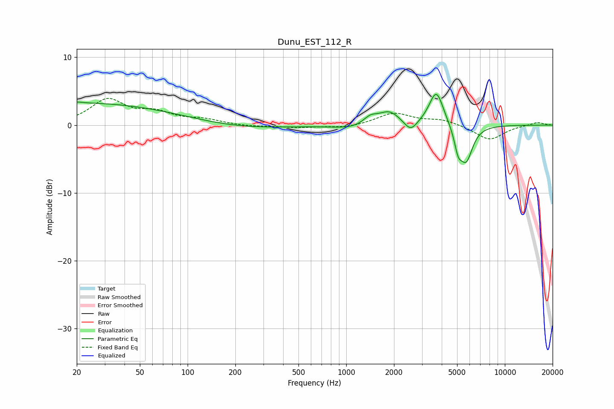

# Dunu_EST_112_R
See [usage instructions](https://github.com/jaakkopasanen/AutoEq#usage) for more options and info.

### Parametric EQs
Apply preamp of -4.6 dB when using parametric equalizer.

|   # | Type    |   Fc (Hz) |    Q |   Gain (dB) |
|-----|---------|-----------|------|-------------|
|   1 | Peaking |        20 | 0.22 |         3.3 |
|   2 | Peaking |        21 | 5.89 |         0.1 |
|   3 | Peaking |       220 | 0.52 |        -0.6 |
|   4 | Peaking |      1090 | 1.22 |        -0.6 |
|   5 | Peaking |      1419 | 3.19 |         1.1 |
|   6 | Peaking |      1866 | 2.09 |         2   |
|   7 | Peaking |      2548 | 3.5  |        -1.7 |
|   8 | Peaking |      3700 | 3.1  |         5.2 |
|   9 | Peaking |      5077 | 5.76 |        -2.8 |
|  10 | Peaking |      5707 | 3.42 |        -5.1 |

### Fixed Band EQs
When using fixed band (also called graphic) equalizer, apply preamp of **-4.0 dB** (if available) and set gains manually with these parameters.

|   # | Type    |   Fc (Hz) |    Q |   Gain (dB) |
|-----|---------|-----------|------|-------------|
|   1 | Peaking |        31 | 1.41 |         3.6 |
|   2 | Peaking |        62 | 1.41 |         1.6 |
|   3 | Peaking |       125 | 1.41 |         0.7 |
|   4 | Peaking |       250 | 1.41 |        -0.2 |
|   5 | Peaking |       500 | 1.41 |        -0.4 |
|   6 | Peaking |      1000 | 1.41 |        -0.4 |
|   7 | Peaking |      2000 | 1.41 |         1.8 |
|   8 | Peaking |      4000 | 1.41 |         0.8 |
|   9 | Peaking |      8000 | 1.41 |        -2.2 |
|  10 | Peaking |     16000 | 1.41 |         0.4 |

### Graphs

