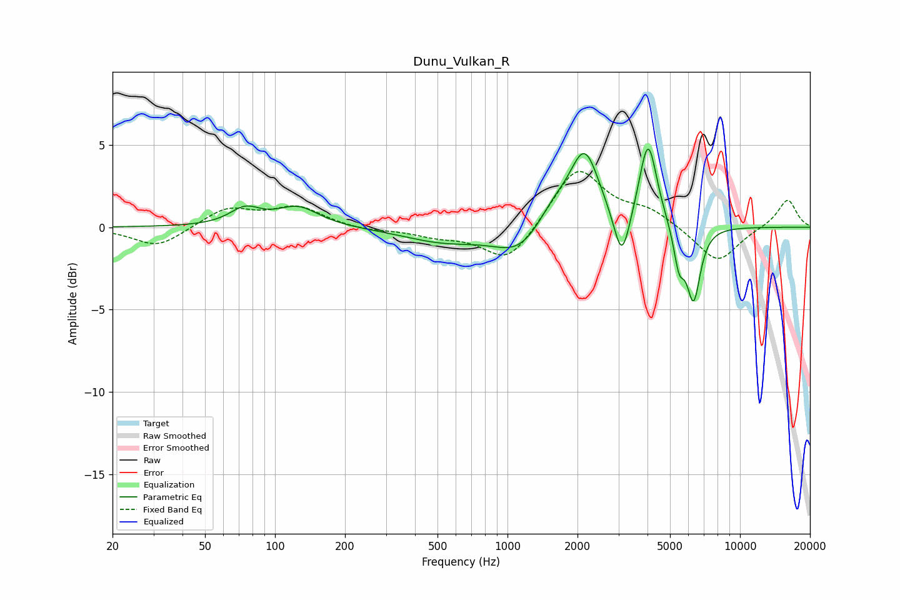

# Dunu_Vulkan_R
See [usage instructions](https://github.com/jaakkopasanen/AutoEq#usage) for more options and info.

### Parametric EQs
Apply preamp of -4.9 dB when using parametric equalizer.

|   # | Type    |   Fc (Hz) |    Q |   Gain (dB) |
|-----|---------|-----------|------|-------------|
|   1 | Peaking |        74 | 2.16 |         1   |
|   2 | Peaking |       125 | 1.55 |         1.2 |
|   3 | Peaking |       530 | 0.81 |        -0.8 |
|   4 | Peaking |      1129 | 1.3  |        -1.6 |
|   5 | Peaking |      1578 | 1.91 |         1.3 |
|   6 | Peaking |      2146 | 2.2  |         4.5 |
|   7 | Peaking |      3103 | 4.12 |        -3.2 |
|   8 | Peaking |      4025 | 3.71 |         5.2 |
|   9 | Peaking |      5468 | 5.98 |        -2.3 |
|  10 | Peaking |      6313 | 4.65 |        -4.4 |

### Fixed Band EQs
When using fixed band (also called graphic) equalizer, apply preamp of **-3.5 dB** (if available) and set gains manually with these parameters.

|   # | Type    |   Fc (Hz) |    Q |   Gain (dB) |
|-----|---------|-----------|------|-------------|
|   1 | Peaking |        31 | 1.41 |        -1.2 |
|   2 | Peaking |        62 | 1.41 |         1.1 |
|   3 | Peaking |       125 | 1.41 |         1.2 |
|   4 | Peaking |       250 | 1.41 |        -0.2 |
|   5 | Peaking |       500 | 1.41 |        -0.5 |
|   6 | Peaking |      1000 | 1.41 |        -2.2 |
|   7 | Peaking |      2000 | 1.41 |         3.7 |
|   8 | Peaking |      4000 | 1.41 |         0.9 |
|   9 | Peaking |      8000 | 1.41 |        -2.2 |
|  10 | Peaking |     16000 | 1.41 |         1.7 |

### Graphs

