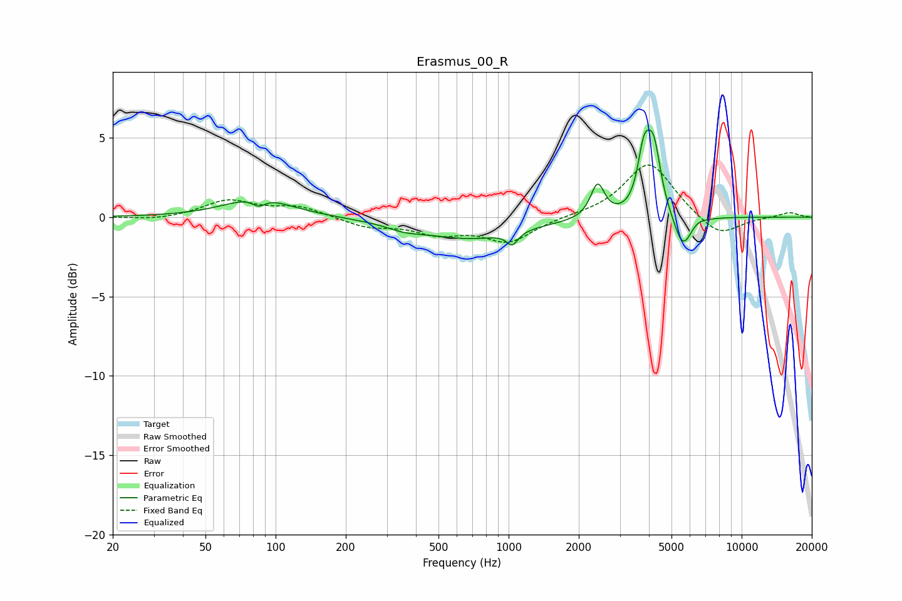

# Erasmus_00_R
See [usage instructions](https://github.com/jaakkopasanen/AutoEq#usage) for more options and info.

### Parametric EQs
Apply preamp of -5.6 dB when using parametric equalizer.

|   # | Type    |   Fc (Hz) |    Q |   Gain (dB) |
|-----|---------|-----------|------|-------------|
|   1 | Peaking |        84 | 1.04 |         1.3 |
|   2 | Peaking |        85 | 5.01 |        -0.5 |
|   3 | Peaking |       357 | 1.89 |        -0.3 |
|   4 | Peaking |       682 | 0.66 |        -1.3 |
|   5 | Peaking |      1037 | 5.91 |        -0.8 |
|   6 | Peaking |      2409 | 4.84 |         2.1 |
|   7 | Peaking |      3800 | 5.55 |         3.1 |
|   8 | Peaking |      4186 | 4.53 |         4.2 |
|   9 | Peaking |      5595 | 3.63 |        -2.1 |
|  10 | Peaking |      6430 | 4.63 |         0.2 |

### Fixed Band EQs
When using fixed band (also called graphic) equalizer, apply preamp of **-3.4 dB** (if available) and set gains manually with these parameters.

|   # | Type    |   Fc (Hz) |    Q |   Gain (dB) |
|-----|---------|-----------|------|-------------|
|   1 | Peaking |        31 | 1.41 |        -0.2 |
|   2 | Peaking |        62 | 1.41 |         1   |
|   3 | Peaking |       125 | 1.41 |         0.7 |
|   4 | Peaking |       250 | 1.41 |        -0.6 |
|   5 | Peaking |       500 | 1.41 |        -0.9 |
|   6 | Peaking |      1000 | 1.41 |        -1.5 |
|   7 | Peaking |      2000 | 1.41 |         0.1 |
|   8 | Peaking |      4000 | 1.41 |         3.5 |
|   9 | Peaking |      8000 | 1.41 |        -1.3 |
|  10 | Peaking |     16000 | 1.41 |         0.3 |

### Graphs

