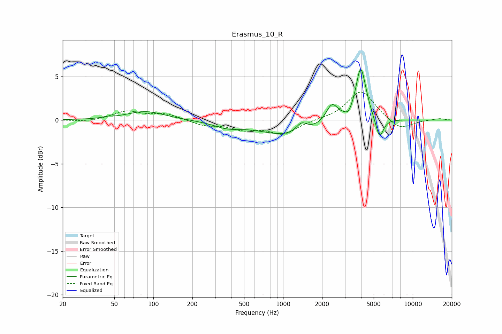

# Erasmus_10_R
See [usage instructions](https://github.com/jaakkopasanen/AutoEq#usage) for more options and info.

### Parametric EQs
Apply preamp of -5.9 dB when using parametric equalizer.

|   # | Type    |   Fc (Hz) |    Q |   Gain (dB) |
|-----|---------|-----------|------|-------------|
|   1 | Peaking |        44 | 5.07 |         0.1 |
|   2 | Peaking |        87 | 0.98 |         1   |
|   3 | Peaking |       372 | 1.29 |        -0.7 |
|   4 | Peaking |      1104 | 0.65 |        -1.7 |
|   5 | Peaking |      1387 | 3.47 |         1.1 |
|   6 | Peaking |      2383 | 3.06 |         2.2 |
|   7 | Peaking |      3198 | 6    |        -0.5 |
|   8 | Peaking |      3916 | 5.93 |         1.2 |
|   9 | Peaking |      4010 | 3.26 |         5.1 |
|  10 | Peaking |      5542 | 4.5  |        -2.5 |

### Fixed Band EQs
When using fixed band (also called graphic) equalizer, apply preamp of **-3.3 dB** (if available) and set gains manually with these parameters.

|   # | Type    |   Fc (Hz) |    Q |   Gain (dB) |
|-----|---------|-----------|------|-------------|
|   1 | Peaking |        31 | 1.41 |        -0.2 |
|   2 | Peaking |        62 | 1.41 |         1   |
|   3 | Peaking |       125 | 1.41 |         0.7 |
|   4 | Peaking |       250 | 1.41 |        -0.6 |
|   5 | Peaking |       500 | 1.41 |        -0.9 |
|   6 | Peaking |      1000 | 1.41 |        -1.5 |
|   7 | Peaking |      2000 | 1.41 |         0   |
|   8 | Peaking |      4000 | 1.41 |         3.4 |
|   9 | Peaking |      8000 | 1.41 |        -1.2 |
|  10 | Peaking |     16000 | 1.41 |         0.2 |

### Graphs

