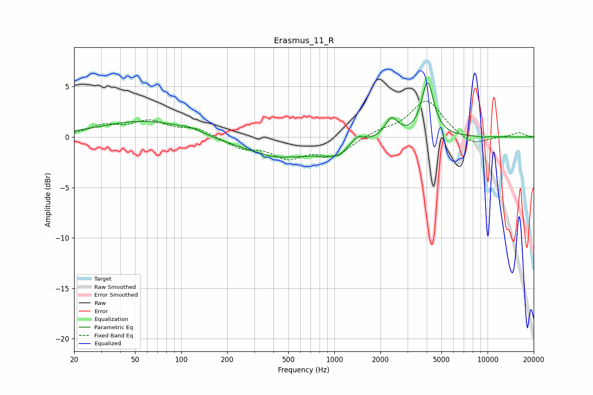

# Erasmus_11_R
See [usage instructions](https://github.com/jaakkopasanen/AutoEq#usage) for more options and info.

### Parametric EQs
Apply preamp of -5.5 dB when using parametric equalizer.

|   # | Type    |   Fc (Hz) |    Q |   Gain (dB) |
|-----|---------|-----------|------|-------------|
|   1 | Peaking |        58 | 0.5  |         1.6 |
|   2 | Peaking |       115 | 1.97 |         0.3 |
|   3 | Peaking |       397 | 2.23 |        -0.1 |
|   4 | Peaking |       502 | 0.46 |        -2   |
|   5 | Peaking |       872 | 3.75 |        -0.4 |
|   6 | Peaking |      1072 | 3.84 |        -0.7 |
|   7 | Peaking |      1427 | 3.78 |         0.8 |
|   8 | Peaking |      2362 | 3.27 |         2   |
|   9 | Peaking |      4060 | 3.61 |         5.4 |
|  10 | Peaking |      9329 | 5.74 |        -0.1 |

### Fixed Band EQs
When using fixed band (also called graphic) equalizer, apply preamp of **-3.7 dB** (if available) and set gains manually with these parameters.

|   # | Type    |   Fc (Hz) |    Q |   Gain (dB) |
|-----|---------|-----------|------|-------------|
|   1 | Peaking |        31 | 1.41 |         1   |
|   2 | Peaking |        62 | 1.41 |         1.4 |
|   3 | Peaking |       125 | 1.41 |         0.8 |
|   4 | Peaking |       250 | 1.41 |        -1   |
|   5 | Peaking |       500 | 1.41 |        -1.9 |
|   6 | Peaking |      1000 | 1.41 |        -1.7 |
|   7 | Peaking |      2000 | 1.41 |         0.5 |
|   8 | Peaking |      4000 | 1.41 |         3.7 |
|   9 | Peaking |      8000 | 1.41 |        -1   |
|  10 | Peaking |     16000 | 1.41 |         0.4 |

### Graphs

