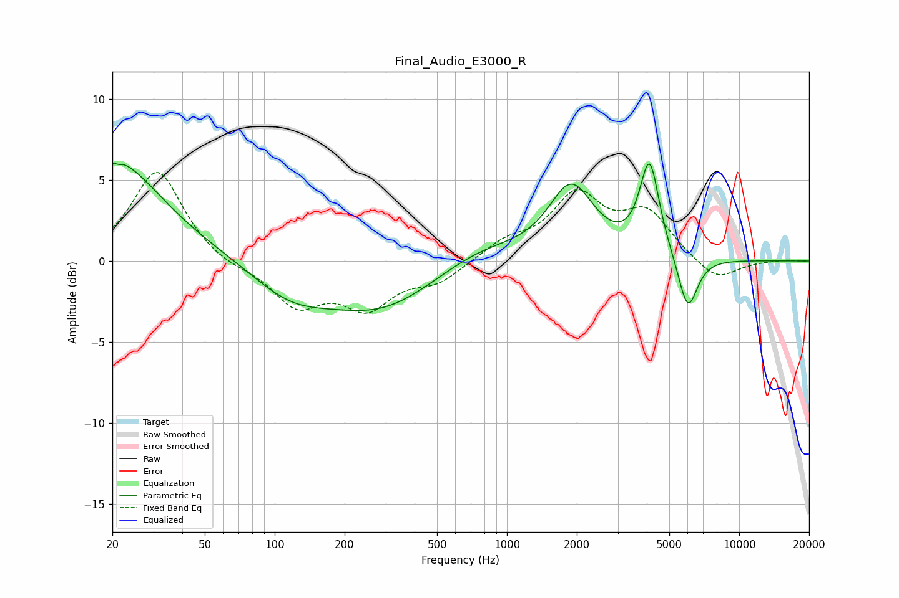

# Final_Audio_E3000_R
See [usage instructions](https://github.com/jaakkopasanen/AutoEq#usage) for more options and info.

### Parametric EQs
Apply preamp of -6.2 dB when using parametric equalizer.

|   # | Type    |   Fc (Hz) |    Q |   Gain (dB) |
|-----|---------|-----------|------|-------------|
|   1 | Peaking |        20 | 0.75 |         5.5 |
|   2 | Peaking |        22 | 5.86 |        -3.4 |
|   3 | Peaking |        22 | 5.9  |         3.3 |
|   4 | Peaking |        22 | 0.33 |         0.9 |
|   5 | Peaking |       117 | 0.81 |        -2   |
|   6 | Peaking |       289 | 0.61 |        -2.8 |
|   7 | Peaking |       774 | 0.78 |         1.1 |
|   8 | Peaking |      1892 | 1.46 |         4.5 |
|   9 | Peaking |      4110 | 3.35 |         5.8 |
|  10 | Peaking |      6009 | 3.31 |        -3.5 |

### Fixed Band EQs
When using fixed band (also called graphic) equalizer, apply preamp of **-5.6 dB** (if available) and set gains manually with these parameters.

|   # | Type    |   Fc (Hz) |    Q |   Gain (dB) |
|-----|---------|-----------|------|-------------|
|   1 | Peaking |        31 | 1.41 |         5.7 |
|   2 | Peaking |        62 | 1.41 |        -0.4 |
|   3 | Peaking |       125 | 1.41 |        -2.6 |
|   4 | Peaking |       250 | 1.41 |        -2.6 |
|   5 | Peaking |       500 | 1.41 |        -1.2 |
|   6 | Peaking |      1000 | 1.41 |         1.1 |
|   7 | Peaking |      2000 | 1.41 |         3.8 |
|   8 | Peaking |      4000 | 1.41 |         2.8 |
|   9 | Peaking |      8000 | 1.41 |        -1.3 |
|  10 | Peaking |     16000 | 1.41 |         0.1 |

### Graphs

