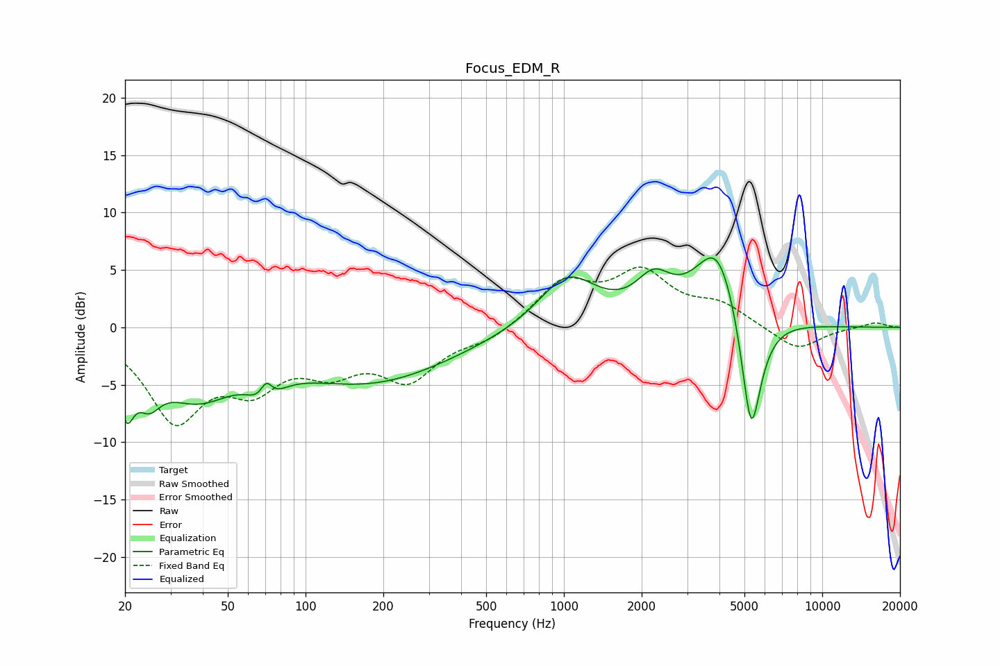

# Focus_EDM_R
See [usage instructions](https://github.com/jaakkopasanen/AutoEq#usage) for more options and info.

### Parametric EQs
Apply preamp of -6.1 dB when using parametric equalizer.

|   # | Type    |   Fc (Hz) |    Q |   Gain (dB) |
|-----|---------|-----------|------|-------------|
|   1 | Peaking |        20 | 4.95 |        -4.7 |
|   2 | Peaking |        25 | 3    |        -3   |
|   3 | Peaking |        38 | 0.93 |        -5.1 |
|   4 | Peaking |        70 | 3.23 |        -4.3 |
|   5 | Peaking |        70 | 4.92 |         3.9 |
|   6 | Peaking |       179 | 0.44 |        -4.6 |
|   7 | Peaking |      1033 | 1.24 |         4.6 |
|   8 | Peaking |      2225 | 2.07 |         3.1 |
|   9 | Peaking |      3950 | 1.57 |         7.5 |
|  10 | Peaking |      5306 | 3.36 |       -11.9 |

### Fixed Band EQs
When using fixed band (also called graphic) equalizer, apply preamp of **-5.4 dB** (if available) and set gains manually with these parameters.

|   # | Type    |   Fc (Hz) |    Q |   Gain (dB) |
|-----|---------|-----------|------|-------------|
|   1 | Peaking |        31 | 1.41 |        -7.6 |
|   2 | Peaking |        62 | 1.41 |        -4.2 |
|   3 | Peaking |       125 | 1.41 |        -3   |
|   4 | Peaking |       250 | 1.41 |        -4.2 |
|   5 | Peaking |       500 | 1.41 |        -1.1 |
|   6 | Peaking |      1000 | 1.41 |         3.8 |
|   7 | Peaking |      2000 | 1.41 |         4.4 |
|   8 | Peaking |      4000 | 1.41 |         1.7 |
|   9 | Peaking |      8000 | 1.41 |        -2.1 |
|  10 | Peaking |     16000 | 1.41 |         0.5 |

### Graphs

