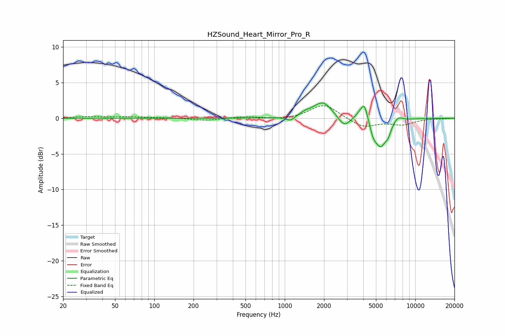

# HZSound_Heart_Mirror_Pro_R
See [usage instructions](https://github.com/jaakkopasanen/AutoEq#usage) for more options and info.

### Parametric EQs
Apply preamp of -2.2 dB when using parametric equalizer.

|   # | Type    |   Fc (Hz) |    Q |   Gain (dB) |
|-----|---------|-----------|------|-------------|
|   1 | Peaking |      1106 | 4.17 |        -0.6 |
|   2 | Peaking |      1427 | 3.25 |         0.4 |
|   3 | Peaking |      1957 | 1.96 |         2.3 |
|   4 | Peaking |      2847 | 3.17 |        -1.5 |
|   5 | Peaking |      3739 | 4.02 |         0.7 |
|   6 | Peaking |      4081 | 5.47 |         2.3 |
|   7 | Peaking |      4758 | 6    |        -1.1 |
|   8 | Peaking |      5405 | 2.91 |        -3.8 |
|   9 | Peaking |      6204 | 6    |        -1   |
|  10 | Peaking |      7361 | 3.98 |         0.8 |

### Fixed Band EQs
When using fixed band (also called graphic) equalizer, apply preamp of **-1.9 dB** (if available) and set gains manually with these parameters.

|   # | Type    |   Fc (Hz) |    Q |   Gain (dB) |
|-----|---------|-----------|------|-------------|
|   1 | Peaking |        31 | 1.41 |         0.2 |
|   2 | Peaking |        62 | 1.41 |         0.2 |
|   3 | Peaking |       125 | 1.41 |         0.1 |
|   4 | Peaking |       250 | 1.41 |        -0.3 |
|   5 | Peaking |       500 | 1.41 |         0.2 |
|   6 | Peaking |      1000 | 1.41 |        -0.3 |
|   7 | Peaking |      2000 | 1.41 |         2   |
|   8 | Peaking |      4000 | 1.41 |        -1.3 |
|   9 | Peaking |      8000 | 1.41 |        -0.8 |
|  10 | Peaking |     16000 | 1.41 |        -0.1 |

### Graphs

