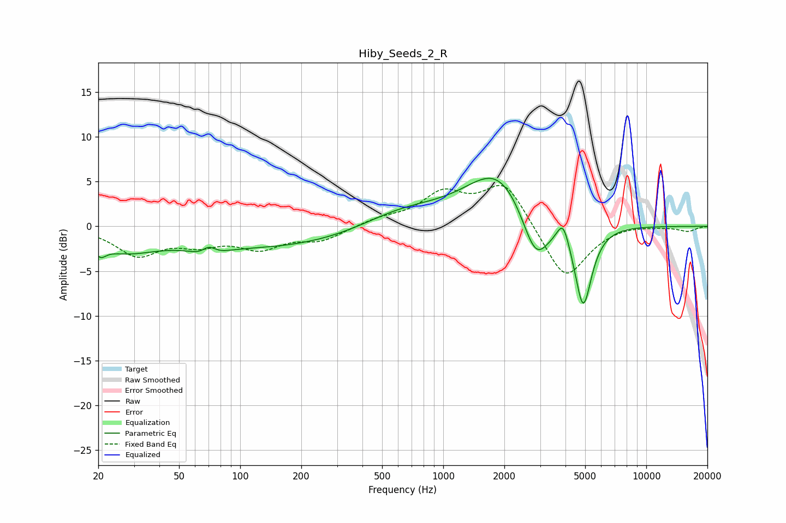

# Hiby_Seeds_2_R
See [usage instructions](https://github.com/jaakkopasanen/AutoEq#usage) for more options and info.

### Parametric EQs
Apply preamp of -5.5 dB when using parametric equalizer.

|   # | Type    |   Fc (Hz) |    Q |   Gain (dB) |
|-----|---------|-----------|------|-------------|
|   1 | Peaking |        20 | 5.27 |        -1.1 |
|   2 | Peaking |        27 | 0.86 |        -2.3 |
|   3 | Peaking |        69 | 2.46 |        -2.2 |
|   4 | Peaking |        70 | 3.62 |         2.2 |
|   5 | Peaking |       152 | 0.29 |        -2.4 |
|   6 | Peaking |       617 | 0.67 |         2.1 |
|   7 | Peaking |      1884 | 0.87 |         6.4 |
|   8 | Peaking |      2851 | 1.98 |        -6.2 |
|   9 | Peaking |      3895 | 4.86 |         2.5 |
|  10 | Peaking |      4890 | 3.25 |        -9.4 |

### Fixed Band EQs
When using fixed band (also called graphic) equalizer, apply preamp of **-4.7 dB** (if available) and set gains manually with these parameters.

|   # | Type    |   Fc (Hz) |    Q |   Gain (dB) |
|-----|---------|-----------|------|-------------|
|   1 | Peaking |        31 | 1.41 |        -3.1 |
|   2 | Peaking |        62 | 1.41 |        -1.6 |
|   3 | Peaking |       125 | 1.41 |        -2.2 |
|   4 | Peaking |       250 | 1.41 |        -1.5 |
|   5 | Peaking |       500 | 1.41 |         0.7 |
|   6 | Peaking |      1000 | 1.41 |         3.4 |
|   7 | Peaking |      2000 | 1.41 |         4.9 |
|   8 | Peaking |      4000 | 1.41 |        -6.2 |
|   9 | Peaking |      8000 | 1.41 |         0.3 |
|  10 | Peaking |     16000 | 1.41 |        -0.5 |

### Graphs

