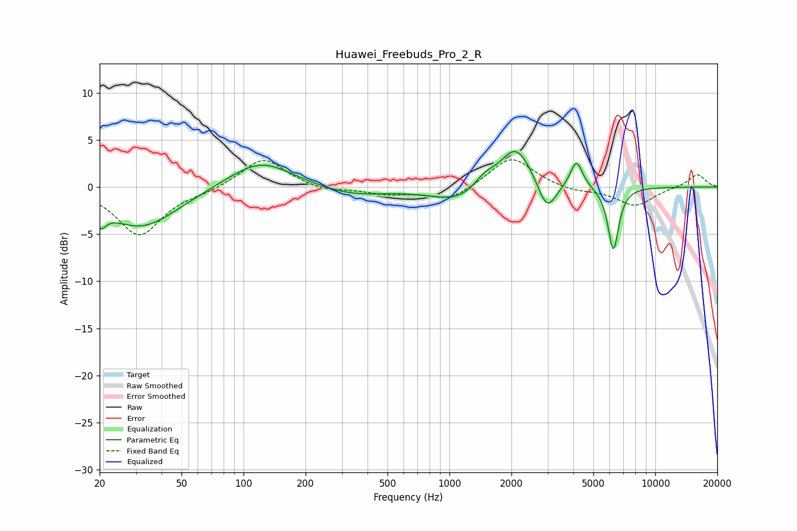

# Huawei_Freebuds_Pro_2_R
See [usage instructions](https://github.com/jaakkopasanen/AutoEq#usage) for more options and info.

### Parametric EQs
Apply preamp of -3.9 dB when using parametric equalizer.

|   # | Type    |   Fc (Hz) |    Q |   Gain (dB) |
|-----|---------|-----------|------|-------------|
|   1 | Peaking |        20 | 5    |        -1.8 |
|   2 | Peaking |        32 | 0.8  |        -4.3 |
|   3 | Peaking |       120 | 0.92 |         3   |
|   4 | Peaking |       334 | 0.83 |        -1   |
|   5 | Peaking |      1127 | 1.06 |        -1.7 |
|   6 | Peaking |      1482 | 2.63 |         1.3 |
|   7 | Peaking |      2102 | 1.82 |         4.6 |
|   8 | Peaking |      2978 | 3.21 |        -3.3 |
|   9 | Peaking |      4139 | 4.76 |         2.9 |
|  10 | Peaking |      6254 | 5.27 |        -6.8 |

### Fixed Band EQs
When using fixed band (also called graphic) equalizer, apply preamp of **-3.0 dB** (if available) and set gains manually with these parameters.

|   # | Type    |   Fc (Hz) |    Q |   Gain (dB) |
|-----|---------|-----------|------|-------------|
|   1 | Peaking |        31 | 1.41 |        -5.1 |
|   2 | Peaking |        62 | 1.41 |        -0.4 |
|   3 | Peaking |       125 | 1.41 |         3.2 |
|   4 | Peaking |       250 | 1.41 |        -0.5 |
|   5 | Peaking |       500 | 1.41 |        -0.7 |
|   6 | Peaking |      1000 | 1.41 |        -1.5 |
|   7 | Peaking |      2000 | 1.41 |         3.3 |
|   8 | Peaking |      4000 | 1.41 |        -0.5 |
|   9 | Peaking |      8000 | 1.41 |        -2   |
|  10 | Peaking |     16000 | 1.41 |         1.4 |

### Graphs

