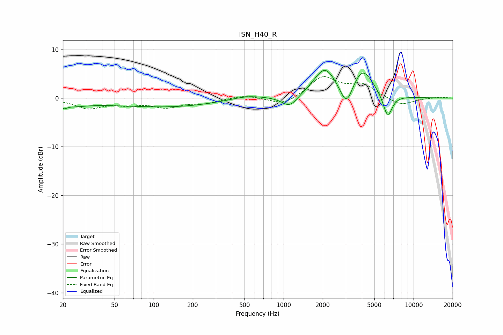

# ISN_H40_R
See [usage instructions](https://github.com/jaakkopasanen/AutoEq#usage) for more options and info.

### Parametric EQs
Apply preamp of -5.8 dB when using parametric equalizer.

|   # | Type    |   Fc (Hz) |    Q |   Gain (dB) |
|-----|---------|-----------|------|-------------|
|   1 | Peaking |        20 | 5.81 |        -0.8 |
|   2 | Peaking |        25 | 1.97 |        -0.5 |
|   3 | Peaking |        59 | 0.18 |        -1.3 |
|   4 | Peaking |       151 | 0.49 |        -0.7 |
|   5 | Peaking |       522 | 1.13 |         0.8 |
|   6 | Peaking |      1116 | 2.31 |        -2.4 |
|   7 | Peaking |      2076 | 1.63 |         6   |
|   8 | Peaking |      3041 | 2.91 |        -4.9 |
|   9 | Peaking |      4049 | 1.74 |         5.8 |
|  10 | Peaking |      6316 | 3.85 |        -4.9 |

### Fixed Band EQs
When using fixed band (also called graphic) equalizer, apply preamp of **-4.5 dB** (if available) and set gains manually with these parameters.

|   # | Type    |   Fc (Hz) |    Q |   Gain (dB) |
|-----|---------|-----------|------|-------------|
|   1 | Peaking |        31 | 1.41 |        -2   |
|   2 | Peaking |        62 | 1.41 |        -1   |
|   3 | Peaking |       125 | 1.41 |        -1.7 |
|   4 | Peaking |       250 | 1.41 |        -0.9 |
|   5 | Peaking |       500 | 1.41 |         0.7 |
|   6 | Peaking |      1000 | 1.41 |        -1.7 |
|   7 | Peaking |      2000 | 1.41 |         4.3 |
|   8 | Peaking |      4000 | 1.41 |         2.6 |
|   9 | Peaking |      8000 | 1.41 |        -1.6 |
|  10 | Peaking |     16000 | 1.41 |         0.2 |

### Graphs

