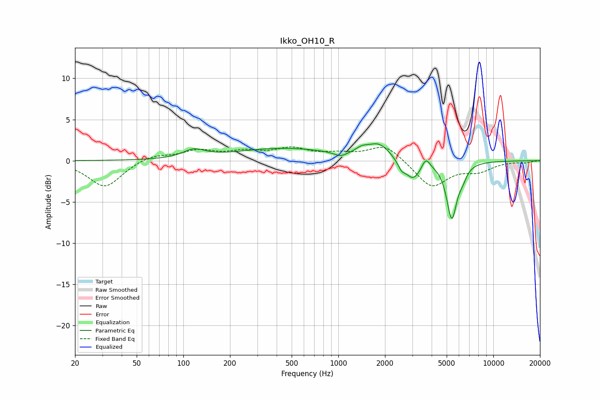

# Ikko_OH10_R
See [usage instructions](https://github.com/jaakkopasanen/AutoEq#usage) for more options and info.

### Parametric EQs
Apply preamp of -2.2 dB when using parametric equalizer.

|   # | Type    |   Fc (Hz) |    Q |   Gain (dB) |
|-----|---------|-----------|------|-------------|
|   1 | Peaking |       117 | 2.06 |         1   |
|   2 | Peaking |       446 | 0.44 |         1.5 |
|   3 | Peaking |      1032 | 3.49 |        -0.5 |
|   4 | Peaking |      1420 | 3.48 |         0.6 |
|   5 | Peaking |      1831 | 1.98 |         1.8 |
|   6 | Peaking |      2553 | 6    |        -0.9 |
|   7 | Peaking |      3029 | 2.85 |        -2.3 |
|   8 | Peaking |      3669 | 5.62 |         1.3 |
|   9 | Peaking |      5390 | 4.21 |        -6.8 |
|  10 | Peaking |      6319 | 4.93 |        -1.1 |

### Fixed Band EQs
When using fixed band (also called graphic) equalizer, apply preamp of **-1.8 dB** (if available) and set gains manually with these parameters.

|   # | Type    |   Fc (Hz) |    Q |   Gain (dB) |
|-----|---------|-----------|------|-------------|
|   1 | Peaking |        31 | 1.41 |        -3.2 |
|   2 | Peaking |        62 | 1.41 |         0.8 |
|   3 | Peaking |       125 | 1.41 |         1.1 |
|   4 | Peaking |       250 | 1.41 |         0.9 |
|   5 | Peaking |       500 | 1.41 |         1.3 |
|   6 | Peaking |      1000 | 1.41 |         0.6 |
|   7 | Peaking |      2000 | 1.41 |         2   |
|   8 | Peaking |      4000 | 1.41 |        -3.2 |
|   9 | Peaking |      8000 | 1.41 |        -1.1 |
|  10 | Peaking |     16000 | 1.41 |        -0.2 |

### Graphs

