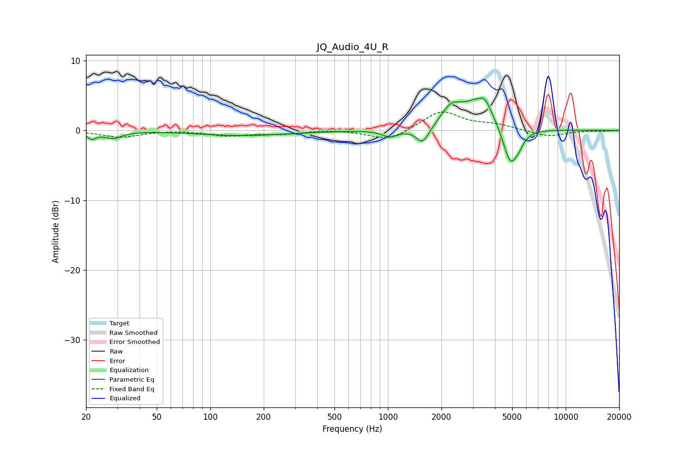

# JQ_Audio_4U_R
See [usage instructions](https://github.com/jaakkopasanen/AutoEq#usage) for more options and info.

### Parametric EQs
Apply preamp of -4.7 dB when using parametric equalizer.

|   # | Type    |   Fc (Hz) |    Q |   Gain (dB) |
|-----|---------|-----------|------|-------------|
|   1 | Peaking |        22 | 5.92 |        -1   |
|   2 | Peaking |        28 | 2.81 |        -1   |
|   3 | Peaking |       154 | 0.56 |        -0.7 |
|   4 | Peaking |      1027 | 3.14 |        -1   |
|   5 | Peaking |      1571 | 3.74 |        -2.5 |
|   6 | Peaking |      2268 | 2.58 |         2.4 |
|   7 | Peaking |      3320 | 1.42 |         4.6 |
|   8 | Peaking |      3515 | 6    |         0.9 |
|   9 | Peaking |      4886 | 2.98 |        -6.1 |
|  10 | Peaking |      5447 | 6    |        -0.6 |

### Fixed Band EQs
When using fixed band (also called graphic) equalizer, apply preamp of **-2.7 dB** (if available) and set gains manually with these parameters.

|   # | Type    |   Fc (Hz) |    Q |   Gain (dB) |
|-----|---------|-----------|------|-------------|
|   1 | Peaking |        31 | 1.41 |        -1   |
|   2 | Peaking |        62 | 1.41 |         0.1 |
|   3 | Peaking |       125 | 1.41 |        -0.7 |
|   4 | Peaking |       250 | 1.41 |        -0.5 |
|   5 | Peaking |       500 | 1.41 |         0.1 |
|   6 | Peaking |      1000 | 1.41 |        -1.5 |
|   7 | Peaking |      2000 | 1.41 |         2.8 |
|   8 | Peaking |      4000 | 1.41 |         0.7 |
|   9 | Peaking |      8000 | 1.41 |        -0.9 |
|  10 | Peaking |     16000 | 1.41 |        -0.1 |

### Graphs

