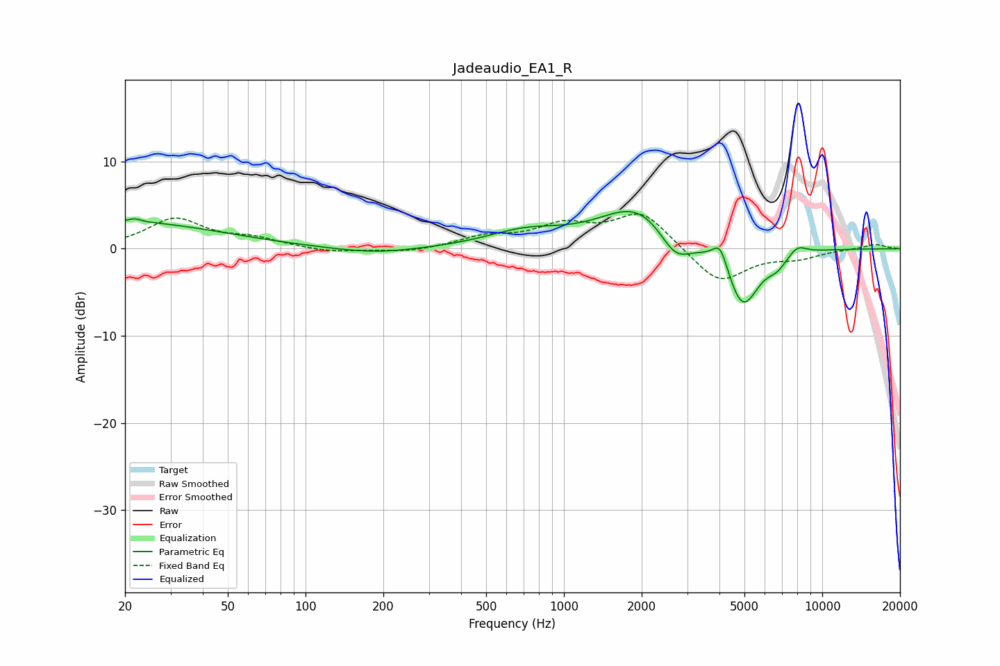

# Jadeaudio_EA1_R
See [usage instructions](https://github.com/jaakkopasanen/AutoEq#usage) for more options and info.

### Parametric EQs
Apply preamp of -4.4 dB when using parametric equalizer.

|   # | Type    |   Fc (Hz) |    Q |   Gain (dB) |
|-----|---------|-----------|------|-------------|
|   1 | Peaking |        20 | 0.39 |         3.1 |
|   2 | Peaking |        22 | 5.86 |         0.4 |
|   3 | Peaking |       185 | 0.87 |        -0.7 |
|   4 | Peaking |       706 | 0.95 |         1.7 |
|   5 | Peaking |      1954 | 0.94 |         5   |
|   6 | Peaking |      2697 | 2.2  |        -3.4 |
|   7 | Peaking |      4026 | 4.82 |         2.8 |
|   8 | Peaking |      4921 | 2.2  |        -7.1 |
|   9 | Peaking |      6690 | 3.53 |        -1.2 |
|  10 | Peaking |      8013 | 3.66 |         1.1 |

### Fixed Band EQs
When using fixed band (also called graphic) equalizer, apply preamp of **-4.1 dB** (if available) and set gains manually with these parameters.

|   # | Type    |   Fc (Hz) |    Q |   Gain (dB) |
|-----|---------|-----------|------|-------------|
|   1 | Peaking |        31 | 1.41 |         3.3 |
|   2 | Peaking |        62 | 1.41 |         1   |
|   3 | Peaking |       125 | 1.41 |        -0.5 |
|   4 | Peaking |       250 | 1.41 |        -0.5 |
|   5 | Peaking |       500 | 1.41 |         1.2 |
|   6 | Peaking |      1000 | 1.41 |         2.4 |
|   7 | Peaking |      2000 | 1.41 |         4.2 |
|   8 | Peaking |      4000 | 1.41 |        -4.1 |
|   9 | Peaking |      8000 | 1.41 |        -0.9 |
|  10 | Peaking |     16000 | 1.41 |         0.5 |

### Graphs

