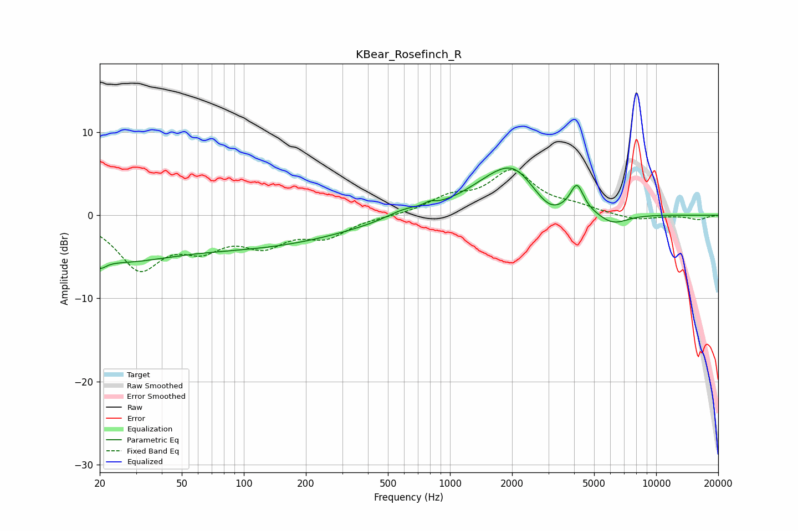

# KBear_Rosefinch_R
See [usage instructions](https://github.com/jaakkopasanen/AutoEq#usage) for more options and info.

### Parametric EQs
Apply preamp of -5.8 dB when using parametric equalizer.

|   # | Type    |   Fc (Hz) |    Q |   Gain (dB) |
|-----|---------|-----------|------|-------------|
|   1 | Peaking |        20 | 4.74 |        -1.2 |
|   2 | Peaking |        23 | 0.5  |        -4.6 |
|   3 | Peaking |       122 | 0.34 |        -3.3 |
|   4 | Peaking |       599 | 1.66 |         0.8 |
|   5 | Peaking |       798 | 5.7  |         0.4 |
|   6 | Peaking |      1884 | 0.85 |         5.4 |
|   7 | Peaking |      2068 | 2.04 |         0.9 |
|   8 | Peaking |      3030 | 1.91 |        -2.1 |
|   9 | Peaking |      4128 | 4.52 |         3.1 |
|  10 | Peaking |      6150 | 1.82 |        -1.5 |

### Fixed Band EQs
When using fixed band (also called graphic) equalizer, apply preamp of **-5.6 dB** (if available) and set gains manually with these parameters.

|   # | Type    |   Fc (Hz) |    Q |   Gain (dB) |
|-----|---------|-----------|------|-------------|
|   1 | Peaking |        31 | 1.41 |        -6.1 |
|   2 | Peaking |        62 | 1.41 |        -3.1 |
|   3 | Peaking |       125 | 1.41 |        -3   |
|   4 | Peaking |       250 | 1.41 |        -2.3 |
|   5 | Peaking |       500 | 1.41 |        -0.1 |
|   6 | Peaking |      1000 | 1.41 |         1.9 |
|   7 | Peaking |      2000 | 1.41 |         5.1 |
|   8 | Peaking |      4000 | 1.41 |         0.8 |
|   9 | Peaking |      8000 | 1.41 |        -0.6 |
|  10 | Peaking |     16000 | 1.41 |        -0.5 |

### Graphs

