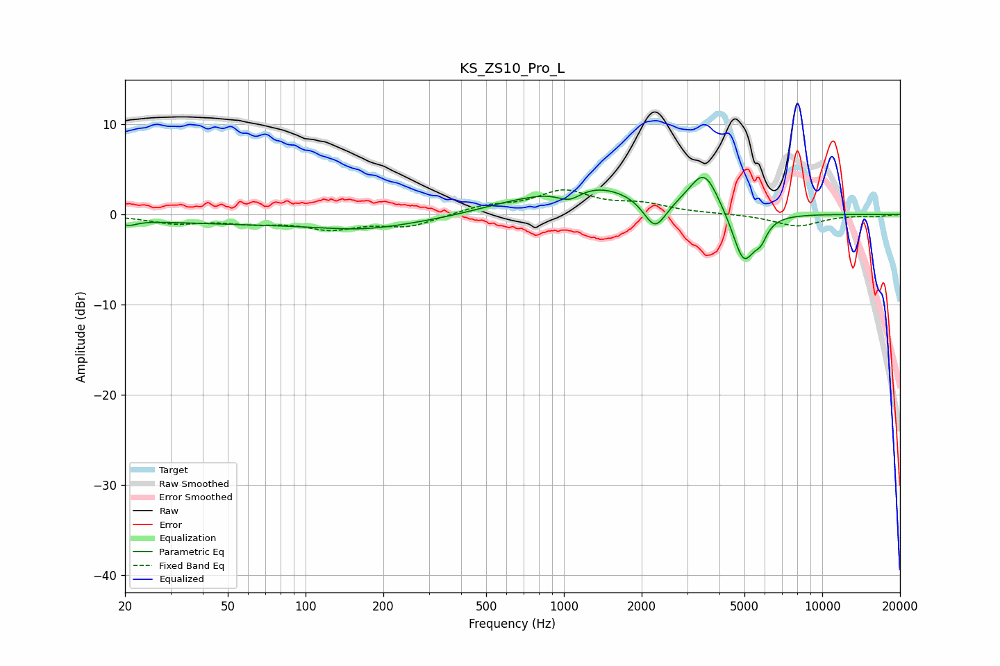

# KS_ZS10_Pro_L
See [usage instructions](https://github.com/jaakkopasanen/AutoEq#usage) for more options and info.

### Parametric EQs
Apply preamp of -4.2 dB when using parametric equalizer.

|   # | Type    |   Fc (Hz) |    Q |   Gain (dB) |
|-----|---------|-----------|------|-------------|
|   1 | Peaking |        21 | 4.44 |        -0.6 |
|   2 | Peaking |       101 | 0.18 |        -1.1 |
|   3 | Peaking |       168 | 0.86 |        -0.7 |
|   4 | Peaking |       587 | 0.9  |         0.6 |
|   5 | Peaking |      1051 | 2.91 |        -1.4 |
|   6 | Peaking |      1254 | 0.7  |         3.4 |
|   7 | Peaking |      2252 | 3.22 |        -3.4 |
|   8 | Peaking |      3493 | 2.46 |         4.5 |
|   9 | Peaking |      4966 | 3.15 |        -5.8 |
|  10 | Peaking |      5784 | 5.8  |        -1.5 |

### Fixed Band EQs
When using fixed band (also called graphic) equalizer, apply preamp of **-2.8 dB** (if available) and set gains manually with these parameters.

|   # | Type    |   Fc (Hz) |    Q |   Gain (dB) |
|-----|---------|-----------|------|-------------|
|   1 | Peaking |        31 | 1.41 |        -0.9 |
|   2 | Peaking |        62 | 1.41 |        -0.7 |
|   3 | Peaking |       125 | 1.41 |        -1.4 |
|   4 | Peaking |       250 | 1.41 |        -1.3 |
|   5 | Peaking |       500 | 1.41 |         0.9 |
|   6 | Peaking |      1000 | 1.41 |         2.5 |
|   7 | Peaking |      2000 | 1.41 |         1   |
|   8 | Peaking |      4000 | 1.41 |         0.1 |
|   9 | Peaking |      8000 | 1.41 |        -1.3 |
|  10 | Peaking |     16000 | 1.41 |        -0.2 |

### Graphs

