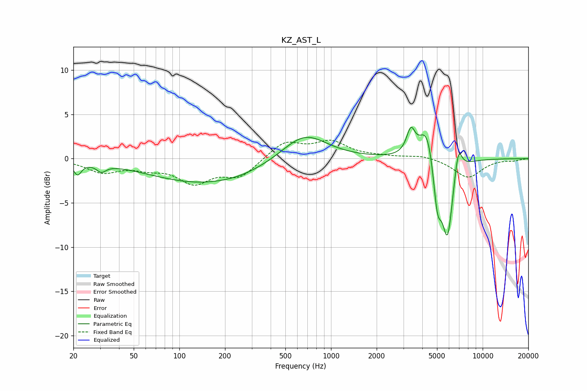

# KZ_AST_L
See [usage instructions](https://github.com/jaakkopasanen/AutoEq#usage) for more options and info.

### Parametric EQs
Apply preamp of -3.6 dB when using parametric equalizer.

|   # | Type    |   Fc (Hz) |    Q |   Gain (dB) |
|-----|---------|-----------|------|-------------|
|   1 | Peaking |        21 | 5.52 |        -1.4 |
|   2 | Peaking |        31 | 4.71 |        -0.8 |
|   3 | Peaking |       147 | 0.38 |        -2.8 |
|   4 | Peaking |       251 | 1.22 |        -0.1 |
|   5 | Peaking |       666 | 0.95 |         3.1 |
|   6 | Peaking |      3362 | 5.07 |         2.7 |
|   7 | Peaking |      4310 | 2.78 |         4.3 |
|   8 | Peaking |      5029 | 5.01 |        -5.5 |
|   9 | Peaking |      5866 | 3.8  |        -8.8 |
|  10 | Peaking |      6908 | 5.43 |         3.2 |

### Fixed Band EQs
When using fixed band (also called graphic) equalizer, apply preamp of **-2.2 dB** (if available) and set gains manually with these parameters.

|   # | Type    |   Fc (Hz) |    Q |   Gain (dB) |
|-----|---------|-----------|------|-------------|
|   1 | Peaking |        31 | 1.41 |        -1.4 |
|   2 | Peaking |        62 | 1.41 |        -0.8 |
|   3 | Peaking |       125 | 1.41 |        -2.5 |
|   4 | Peaking |       250 | 1.41 |        -2   |
|   5 | Peaking |       500 | 1.41 |         1.9 |
|   6 | Peaking |      1000 | 1.41 |         1.8 |
|   7 | Peaking |      2000 | 1.41 |         0.2 |
|   8 | Peaking |      4000 | 1.41 |         0.4 |
|   9 | Peaking |      8000 | 1.41 |        -2.1 |
|  10 | Peaking |     16000 | 1.41 |        -0.2 |

### Graphs

