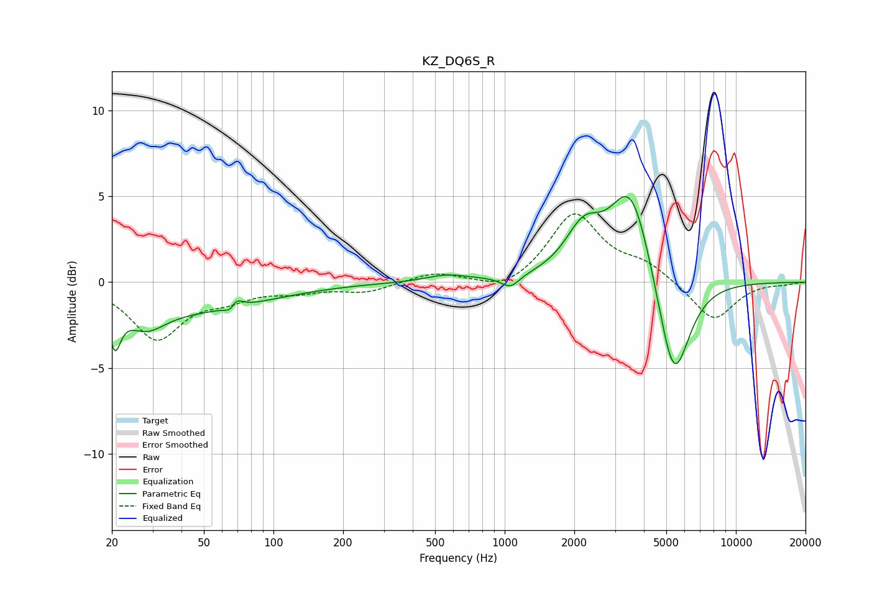

# KZ_DQ6S_R
See [usage instructions](https://github.com/jaakkopasanen/AutoEq#usage) for more options and info.

### Parametric EQs
Apply preamp of -5.1 dB when using parametric equalizer.

|   # | Type    |   Fc (Hz) |    Q |   Gain (dB) |
|-----|---------|-----------|------|-------------|
|   1 | Peaking |        21 | 5.71 |        -2.4 |
|   2 | Peaking |        28 | 1.59 |        -1.6 |
|   3 | Peaking |        50 | 0.48 |        -1.4 |
|   4 | Peaking |        66 | 5.56 |        -1.5 |
|   5 | Peaking |        67 | 5.22 |         1.6 |
|   6 | Peaking |       562 | 1.56 |         0.4 |
|   7 | Peaking |      1059 | 3.55 |        -0.7 |
|   8 | Peaking |      2193 | 1.78 |         2.6 |
|   9 | Peaking |      3512 | 1.6  |         5.6 |
|  10 | Peaking |      5381 | 2.03 |        -6.6 |

### Fixed Band EQs
When using fixed band (also called graphic) equalizer, apply preamp of **-4.1 dB** (if available) and set gains manually with these parameters.

|   # | Type    |   Fc (Hz) |    Q |   Gain (dB) |
|-----|---------|-----------|------|-------------|
|   1 | Peaking |        31 | 1.41 |        -3.2 |
|   2 | Peaking |        62 | 1.41 |        -0.8 |
|   3 | Peaking |       125 | 1.41 |        -0.5 |
|   4 | Peaking |       250 | 1.41 |        -0.5 |
|   5 | Peaking |       500 | 1.41 |         0.6 |
|   6 | Peaking |      1000 | 1.41 |        -0.7 |
|   7 | Peaking |      2000 | 1.41 |         4   |
|   8 | Peaking |      4000 | 1.41 |         0.9 |
|   9 | Peaking |      8000 | 1.41 |        -2.3 |
|  10 | Peaking |     16000 | 1.41 |        -0.1 |

### Graphs

