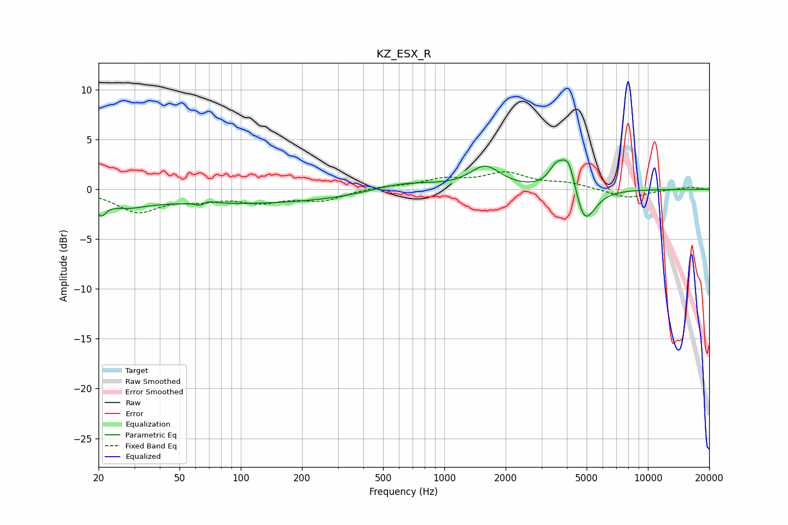

# KZ_ESX_R
See [usage instructions](https://github.com/jaakkopasanen/AutoEq#usage) for more options and info.

### Parametric EQs
Apply preamp of -3.0 dB when using parametric equalizer.

|   # | Type    |   Fc (Hz) |    Q |   Gain (dB) |
|-----|---------|-----------|------|-------------|
|   1 | Peaking |        21 | 5.67 |        -1.5 |
|   2 | Peaking |        27 | 1.53 |        -0.9 |
|   3 | Peaking |        64 | 4.84 |        -1.4 |
|   4 | Peaking |        65 | 4.11 |         1.4 |
|   5 | Peaking |       101 | 0.21 |        -1.4 |
|   6 | Peaking |       630 | 0.84 |         1   |
|   7 | Peaking |      1588 | 1.9  |         2.2 |
|   8 | Peaking |      3546 | 3.71 |         1.9 |
|   9 | Peaking |      4092 | 3.77 |         3.6 |
|  10 | Peaking |      4857 | 2.7  |        -4.1 |

### Fixed Band EQs
When using fixed band (also called graphic) equalizer, apply preamp of **-1.9 dB** (if available) and set gains manually with these parameters.

|   # | Type    |   Fc (Hz) |    Q |   Gain (dB) |
|-----|---------|-----------|------|-------------|
|   1 | Peaking |        31 | 1.41 |        -2.2 |
|   2 | Peaking |        62 | 1.41 |        -0.8 |
|   3 | Peaking |       125 | 1.41 |        -1.1 |
|   4 | Peaking |       250 | 1.41 |        -1   |
|   5 | Peaking |       500 | 1.41 |         0.3 |
|   6 | Peaking |      1000 | 1.41 |         0.9 |
|   7 | Peaking |      2000 | 1.41 |         1.5 |
|   8 | Peaking |      4000 | 1.41 |         0.6 |
|   9 | Peaking |      8000 | 1.41 |        -0.9 |
|  10 | Peaking |     16000 | 1.41 |         0.2 |

### Graphs

