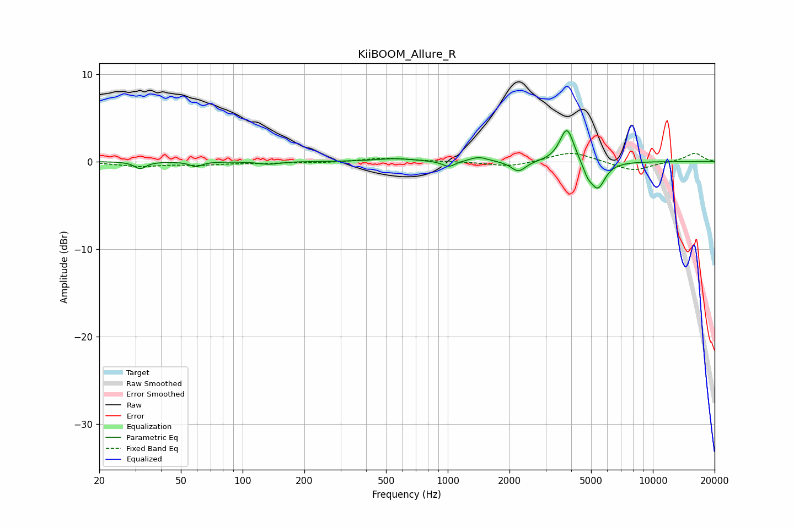

# KiiBOOM_Allure_R
See [usage instructions](https://github.com/jaakkopasanen/AutoEq#usage) for more options and info.

### Parametric EQs
Apply preamp of -3.6 dB when using parametric equalizer.

|   # | Type    |   Fc (Hz) |    Q |   Gain (dB) |
|-----|---------|-----------|------|-------------|
|   1 | Peaking |        32 | 5.27 |        -0.8 |
|   2 | Peaking |        59 | 5.04 |        -0.6 |
|   3 | Peaking |       134 | 2.96 |        -0.3 |
|   4 | Peaking |       553 | 1.58 |         0.3 |
|   5 | Peaking |      1012 | 4.56 |        -0.7 |
|   6 | Peaking |      1415 | 3.27 |         0.5 |
|   7 | Peaking |      2211 | 4.05 |        -1.2 |
|   8 | Peaking |      3811 | 4.1  |         4   |
|   9 | Peaking |      4803 | 6    |        -1.1 |
|  10 | Peaking |      5386 | 3.83 |        -3.1 |

### Fixed Band EQs
When using fixed band (also called graphic) equalizer, apply preamp of **-1.0 dB** (if available) and set gains manually with these parameters.

|   # | Type    |   Fc (Hz) |    Q |   Gain (dB) |
|-----|---------|-----------|------|-------------|
|   1 | Peaking |        31 | 1.41 |        -0.5 |
|   2 | Peaking |        62 | 1.41 |        -0.3 |
|   3 | Peaking |       125 | 1.41 |        -0.1 |
|   4 | Peaking |       250 | 1.41 |        -0.1 |
|   5 | Peaking |       500 | 1.41 |         0.4 |
|   6 | Peaking |      1000 | 1.41 |         0   |
|   7 | Peaking |      2000 | 1.41 |        -0.6 |
|   8 | Peaking |      4000 | 1.41 |         1.2 |
|   9 | Peaking |      8000 | 1.41 |        -1.1 |
|  10 | Peaking |     16000 | 1.41 |         1   |

### Graphs

