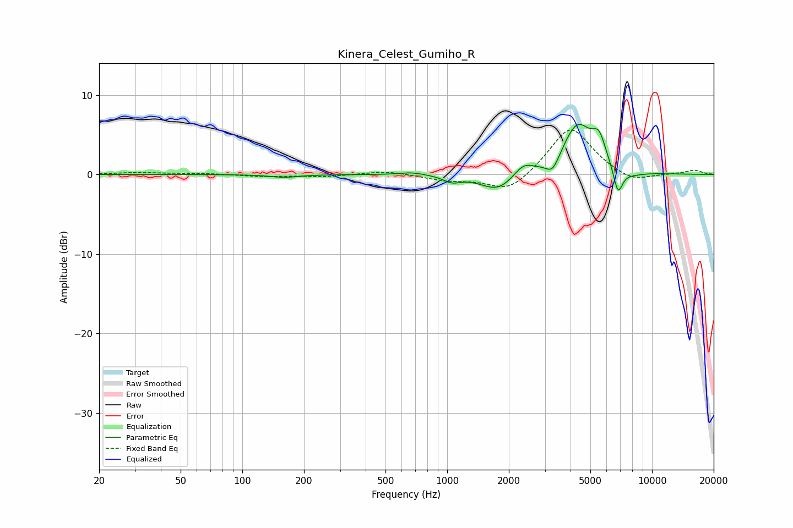

# Kinera_Celest_Gumiho_R
See [usage instructions](https://github.com/jaakkopasanen/AutoEq#usage) for more options and info.

### Parametric EQs
Apply preamp of -6.4 dB when using parametric equalizer.

|   # | Type    |   Fc (Hz) |    Q |   Gain (dB) |
|-----|---------|-----------|------|-------------|
|   1 | Peaking |       160 | 2.03 |        -0.4 |
|   2 | Peaking |       673 | 2.26 |         0.3 |
|   3 | Peaking |      1056 | 3.39 |        -0.8 |
|   4 | Peaking |      1768 | 1.68 |        -2.2 |
|   5 | Peaking |      2352 | 3.02 |         1.4 |
|   6 | Peaking |      3272 | 4.27 |        -1.9 |
|   7 | Peaking |      4324 | 1.89 |         6.2 |
|   8 | Peaking |      5510 | 4.13 |         3   |
|   9 | Peaking |      6821 | 5.95 |        -3.4 |
|  10 | Peaking |      7900 | 2.08 |        -0.5 |

### Fixed Band EQs
When using fixed band (also called graphic) equalizer, apply preamp of **-5.7 dB** (if available) and set gains manually with these parameters.

|   # | Type    |   Fc (Hz) |    Q |   Gain (dB) |
|-----|---------|-----------|------|-------------|
|   1 | Peaking |        31 | 1.41 |         0.2 |
|   2 | Peaking |        62 | 1.41 |         0.1 |
|   3 | Peaking |       125 | 1.41 |        -0.2 |
|   4 | Peaking |       250 | 1.41 |        -0.3 |
|   5 | Peaking |       500 | 1.41 |         0.5 |
|   6 | Peaking |      1000 | 1.41 |        -0.7 |
|   7 | Peaking |      2000 | 1.41 |        -2.4 |
|   8 | Peaking |      4000 | 1.41 |         6.2 |
|   9 | Peaking |      8000 | 1.41 |        -1.2 |
|  10 | Peaking |     16000 | 1.41 |         0.5 |

### Graphs

