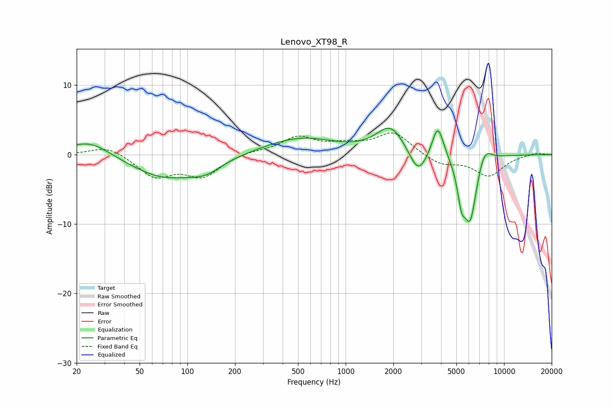

# Lenovo_XT98_R
See [usage instructions](https://github.com/jaakkopasanen/AutoEq#usage) for more options and info.

### Parametric EQs
Apply preamp of -3.9 dB when using parametric equalizer.

|   # | Type    |   Fc (Hz) |    Q |   Gain (dB) |
|-----|---------|-----------|------|-------------|
|   1 | Peaking |        24 | 1.08 |         2.3 |
|   2 | Peaking |        71 | 0.68 |        -3.3 |
|   3 | Peaking |       130 | 1.4  |        -1.6 |
|   4 | Peaking |       514 | 0.63 |         2.4 |
|   5 | Peaking |      1922 | 1.59 |         4   |
|   6 | Peaking |      2874 | 2.52 |        -3.7 |
|   7 | Peaking |      3821 | 3.78 |         4.9 |
|   8 | Peaking |      5379 | 5.82 |        -4   |
|   9 | Peaking |      6107 | 3.1  |        -9.7 |
|  10 | Peaking |      7486 | 2.93 |         2.7 |

### Fixed Band EQs
When using fixed band (also called graphic) equalizer, apply preamp of **-3.2 dB** (if available) and set gains manually with these parameters.

|   # | Type    |   Fc (Hz) |    Q |   Gain (dB) |
|-----|---------|-----------|------|-------------|
|   1 | Peaking |        31 | 1.41 |         1.3 |
|   2 | Peaking |        62 | 1.41 |        -3.1 |
|   3 | Peaking |       125 | 1.41 |        -3   |
|   4 | Peaking |       250 | 1.41 |         0.4 |
|   5 | Peaking |       500 | 1.41 |         2.4 |
|   6 | Peaking |      1000 | 1.41 |         1.1 |
|   7 | Peaking |      2000 | 1.41 |         3.1 |
|   8 | Peaking |      4000 | 1.41 |        -1.5 |
|   9 | Peaking |      8000 | 1.41 |        -3   |
|  10 | Peaking |     16000 | 1.41 |         0.3 |

### Graphs

