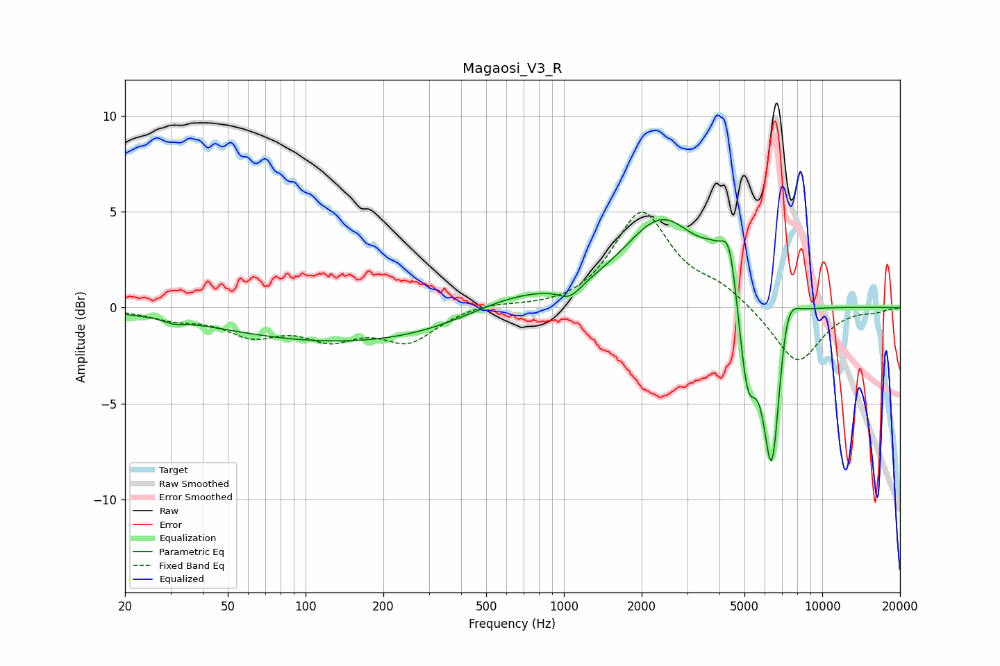

# Magaosi_V3_R
See [usage instructions](https://github.com/jaakkopasanen/AutoEq#usage) for more options and info.

### Parametric EQs
Apply preamp of -4.7 dB when using parametric equalizer.

|   # | Type    |   Fc (Hz) |    Q |   Gain (dB) |
|-----|---------|-----------|------|-------------|
|   1 | Peaking |        31 | 4.14 |        -0.2 |
|   2 | Peaking |       182 | 0.24 |        -1.9 |
|   3 | Peaking |       623 | 0.66 |         1.4 |
|   4 | Peaking |      1055 | 3.15 |        -0.7 |
|   5 | Peaking |      2407 | 0.94 |         4.6 |
|   6 | Peaking |      3779 | 2.68 |         1   |
|   7 | Peaking |      4379 | 4.4  |         2.9 |
|   8 | Peaking |      5130 | 3.97 |        -4.8 |
|   9 | Peaking |      6387 | 3.89 |        -9.3 |
|  10 | Peaking |      7248 | 3.35 |         2.5 |

### Fixed Band EQs
When using fixed band (also called graphic) equalizer, apply preamp of **-5.1 dB** (if available) and set gains manually with these parameters.

|   # | Type    |   Fc (Hz) |    Q |   Gain (dB) |
|-----|---------|-----------|------|-------------|
|   1 | Peaking |        31 | 1.41 |        -0.5 |
|   2 | Peaking |        62 | 1.41 |        -1.3 |
|   3 | Peaking |       125 | 1.41 |        -1.4 |
|   4 | Peaking |       250 | 1.41 |        -1.7 |
|   5 | Peaking |       500 | 1.41 |         0.3 |
|   6 | Peaking |      1000 | 1.41 |        -0.1 |
|   7 | Peaking |      2000 | 1.41 |         4.9 |
|   8 | Peaking |      4000 | 1.41 |         0.9 |
|   9 | Peaking |      8000 | 1.41 |        -3   |
|  10 | Peaking |     16000 | 1.41 |        -0.2 |

### Graphs

