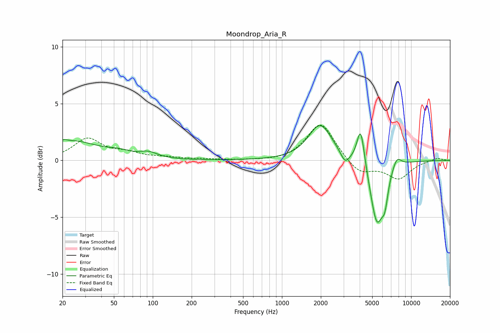

# Moondrop_Aria_R
See [usage instructions](https://github.com/jaakkopasanen/AutoEq#usage) for more options and info.

### Parametric EQs
Apply preamp of -3.2 dB when using parametric equalizer.

|   # | Type    |   Fc (Hz) |    Q |   Gain (dB) |
|-----|---------|-----------|------|-------------|
|   1 | Peaking |        20 | 5.98 |         0.2 |
|   2 | Peaking |        24 | 0.71 |         1.6 |
|   3 | Peaking |        54 | 1.58 |         0.4 |
|   4 | Peaking |        93 | 2.1  |         0.5 |
|   5 | Peaking |      1979 | 1.57 |         3.2 |
|   6 | Peaking |      3081 | 4.37 |        -0.9 |
|   7 | Peaking |      4071 | 4.78 |         3.5 |
|   8 | Peaking |      5439 | 2.67 |        -5.6 |
|   9 | Peaking |      6273 | 5.99 |        -1.8 |
|  10 | Peaking |      7743 | 3.87 |         1   |

### Fixed Band EQs
When using fixed band (also called graphic) equalizer, apply preamp of **-3.2 dB** (if available) and set gains manually with these parameters.

|   # | Type    |   Fc (Hz) |    Q |   Gain (dB) |
|-----|---------|-----------|------|-------------|
|   1 | Peaking |        31 | 1.41 |         1.9 |
|   2 | Peaking |        62 | 1.41 |         0.5 |
|   3 | Peaking |       125 | 1.41 |         0.2 |
|   4 | Peaking |       250 | 1.41 |         0.1 |
|   5 | Peaking |       500 | 1.41 |        -0   |
|   6 | Peaking |      1000 | 1.41 |        -0.1 |
|   7 | Peaking |      2000 | 1.41 |         3.4 |
|   8 | Peaking |      4000 | 1.41 |        -1.2 |
|   9 | Peaking |      8000 | 1.41 |        -1.6 |
|  10 | Peaking |     16000 | 1.41 |         0.2 |

### Graphs

