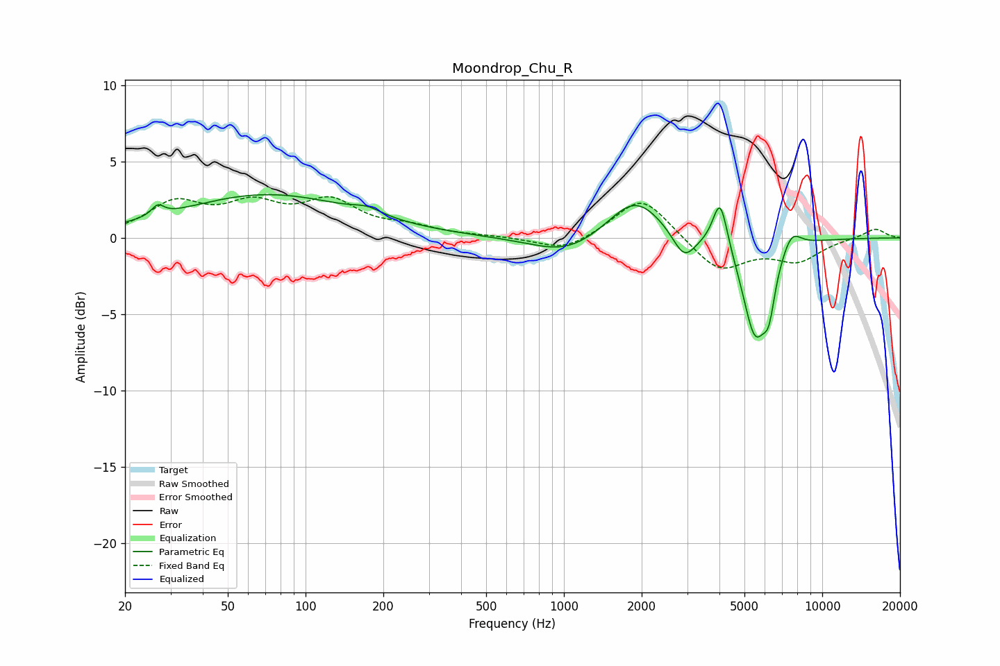

# Moondrop_Chu_R
See [usage instructions](https://github.com/jaakkopasanen/AutoEq#usage) for more options and info.

### Parametric EQs
Apply preamp of -2.9 dB when using parametric equalizer.

|   # | Type    |   Fc (Hz) |    Q |   Gain (dB) |
|-----|---------|-----------|------|-------------|
|   1 | Peaking |        27 | 5.93 |         0.7 |
|   2 | Peaking |        71 | 0.42 |         2.8 |
|   3 | Peaking |       173 | 2.54 |         0.4 |
|   4 | Peaking |      1029 | 1.03 |        -1.2 |
|   5 | Peaking |      1886 | 1.34 |         2.8 |
|   6 | Peaking |      2920 | 3.17 |        -1.8 |
|   7 | Peaking |      4027 | 4.95 |         3.3 |
|   8 | Peaking |      5499 | 2.8  |        -6.3 |
|   9 | Peaking |      6224 | 5.98 |        -2.4 |
|  10 | Peaking |      7608 | 3.62 |         1.3 |

### Fixed Band EQs
When using fixed band (also called graphic) equalizer, apply preamp of **-2.8 dB** (if available) and set gains manually with these parameters.

|   # | Type    |   Fc (Hz) |    Q |   Gain (dB) |
|-----|---------|-----------|------|-------------|
|   1 | Peaking |        31 | 1.41 |         2.1 |
|   2 | Peaking |        62 | 1.41 |         1.9 |
|   3 | Peaking |       125 | 1.41 |         2.2 |
|   4 | Peaking |       250 | 1.41 |         0.6 |
|   5 | Peaking |       500 | 1.41 |         0.1 |
|   6 | Peaking |      1000 | 1.41 |        -0.9 |
|   7 | Peaking |      2000 | 1.41 |         2.8 |
|   8 | Peaking |      4000 | 1.41 |        -2.2 |
|   9 | Peaking |      8000 | 1.41 |        -1.4 |
|  10 | Peaking |     16000 | 1.41 |         0.6 |

### Graphs

