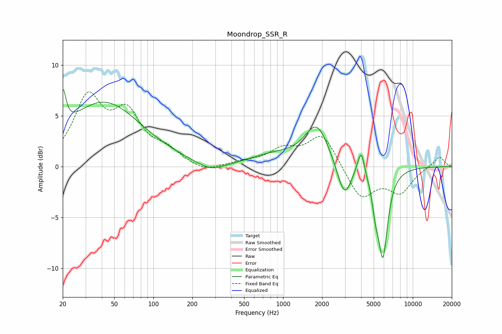

# Moondrop_SSR_R
See [usage instructions](https://github.com/jaakkopasanen/AutoEq#usage) for more options and info.

### Parametric EQs
Apply preamp of -7.7 dB when using parametric equalizer.

|   # | Type    |   Fc (Hz) |    Q |   Gain (dB) |
|-----|---------|-----------|------|-------------|
|   1 | Peaking |        20 | 6    |         3.7 |
|   2 | Peaking |        41 | 0.49 |         6.3 |
|   3 | Peaking |       276 | 1.27 |        -0.9 |
|   4 | Peaking |       844 | 0.78 |         1   |
|   5 | Peaking |      1820 | 1.53 |         4   |
|   6 | Peaking |      2969 | 2.56 |        -3.5 |
|   7 | Peaking |      3829 | 4.18 |         0.8 |
|   8 | Peaking |      4025 | 6    |         1.9 |
|   9 | Peaking |      5153 | 5.91 |        -2   |
|  10 | Peaking |      5881 | 3.66 |        -8.6 |

### Fixed Band EQs
When using fixed band (also called graphic) equalizer, apply preamp of **-7.5 dB** (if available) and set gains manually with these parameters.

|   # | Type    |   Fc (Hz) |    Q |   Gain (dB) |
|-----|---------|-----------|------|-------------|
|   1 | Peaking |        31 | 1.41 |         6.4 |
|   2 | Peaking |        62 | 1.41 |         4.6 |
|   3 | Peaking |       125 | 1.41 |         1.3 |
|   4 | Peaking |       250 | 1.41 |        -0.6 |
|   5 | Peaking |       500 | 1.41 |         0.3 |
|   6 | Peaking |      1000 | 1.41 |         1.5 |
|   7 | Peaking |      2000 | 1.41 |         3.2 |
|   8 | Peaking |      4000 | 1.41 |        -3.2 |
|   9 | Peaking |      8000 | 1.41 |        -2.4 |
|  10 | Peaking |     16000 | 1.41 |         1   |

### Graphs

