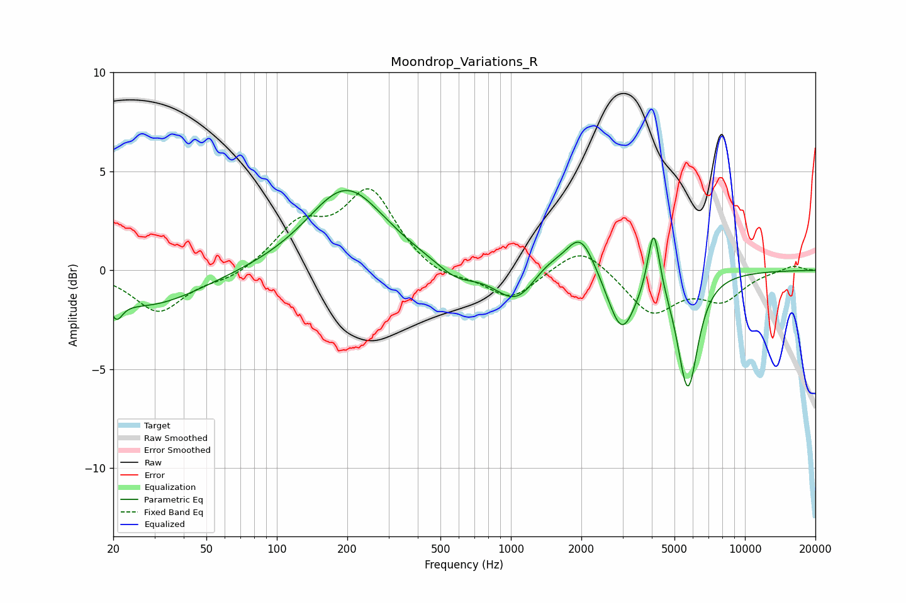

# Moondrop_Variations_R
See [usage instructions](https://github.com/jaakkopasanen/AutoEq#usage) for more options and info.

### Parametric EQs
Apply preamp of -4.1 dB when using parametric equalizer.

|   # | Type    |   Fc (Hz) |    Q |   Gain (dB) |
|-----|---------|-----------|------|-------------|
|   1 | Peaking |        21 | 5.65 |        -1   |
|   2 | Peaking |        28 | 0.63 |        -1.8 |
|   3 | Peaking |       198 | 0.87 |         4.2 |
|   4 | Peaking |       583 | 1.76 |        -0.7 |
|   5 | Peaking |      1060 | 1.56 |        -1.8 |
|   6 | Peaking |      1414 | 1.77 |         0.7 |
|   7 | Peaking |      1988 | 2.28 |         2.1 |
|   8 | Peaking |      2975 | 2.37 |        -3.1 |
|   9 | Peaking |      4076 | 5.7  |         3.3 |
|  10 | Peaking |      5700 | 3.21 |        -5.9 |

### Fixed Band EQs
When using fixed band (also called graphic) equalizer, apply preamp of **-4.2 dB** (if available) and set gains manually with these parameters.

|   # | Type    |   Fc (Hz) |    Q |   Gain (dB) |
|-----|---------|-----------|------|-------------|
|   1 | Peaking |        31 | 1.41 |        -2.1 |
|   2 | Peaking |        62 | 1.41 |        -0.5 |
|   3 | Peaking |       125 | 1.41 |         2.1 |
|   4 | Peaking |       250 | 1.41 |         3.9 |
|   5 | Peaking |       500 | 1.41 |        -0.5 |
|   6 | Peaking |      1000 | 1.41 |        -1.5 |
|   7 | Peaking |      2000 | 1.41 |         1.4 |
|   8 | Peaking |      4000 | 1.41 |        -2.2 |
|   9 | Peaking |      8000 | 1.41 |        -1.4 |
|  10 | Peaking |     16000 | 1.41 |         0.3 |

### Graphs

