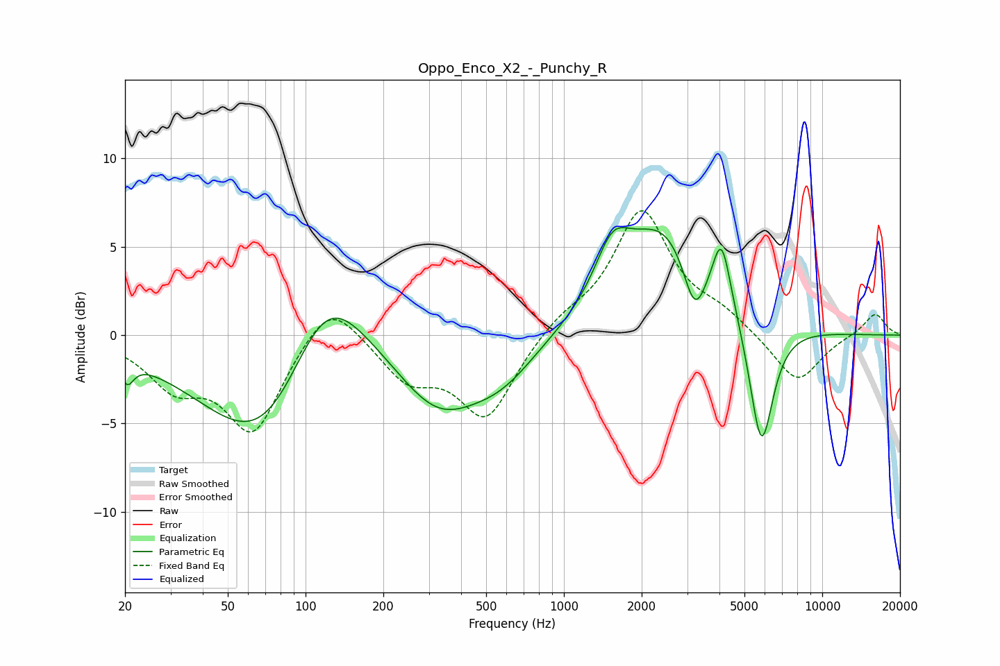

# Oppo_Enco_X2_-_Punchy_R
See [usage instructions](https://github.com/jaakkopasanen/AutoEq#usage) for more options and info.

### Parametric EQs
Apply preamp of -6.2 dB when using parametric equalizer.

|   # | Type    |   Fc (Hz) |    Q |   Gain (dB) |
|-----|---------|-----------|------|-------------|
|   1 | Peaking |        20 | 5.64 |        -1.3 |
|   2 | Peaking |        73 | 0.59 |        -8.1 |
|   3 | Peaking |       118 | 0.84 |         7.4 |
|   4 | Peaking |       328 | 0.86 |        -3.9 |
|   5 | Peaking |       578 | 1.05 |        -1.8 |
|   6 | Peaking |      1537 | 2.1  |         2.9 |
|   7 | Peaking |      2455 | 0.84 |         6.1 |
|   8 | Peaking |      3206 | 3.16 |        -3.3 |
|   9 | Peaking |      4078 | 4.02 |         3.7 |
|  10 | Peaking |      5812 | 2.94 |        -7.4 |

### Fixed Band EQs
When using fixed band (also called graphic) equalizer, apply preamp of **-7.1 dB** (if available) and set gains manually with these parameters.

|   # | Type    |   Fc (Hz) |    Q |   Gain (dB) |
|-----|---------|-----------|------|-------------|
|   1 | Peaking |        31 | 1.41 |        -2.5 |
|   2 | Peaking |        62 | 1.41 |        -5.3 |
|   3 | Peaking |       125 | 1.41 |         2.5 |
|   4 | Peaking |       250 | 1.41 |        -2.3 |
|   5 | Peaking |       500 | 1.41 |        -4.6 |
|   6 | Peaking |      1000 | 1.41 |         0.9 |
|   7 | Peaking |      2000 | 1.41 |         7   |
|   8 | Peaking |      4000 | 1.41 |         1   |
|   9 | Peaking |      8000 | 1.41 |        -2.8 |
|  10 | Peaking |     16000 | 1.41 |         1.3 |

### Graphs

