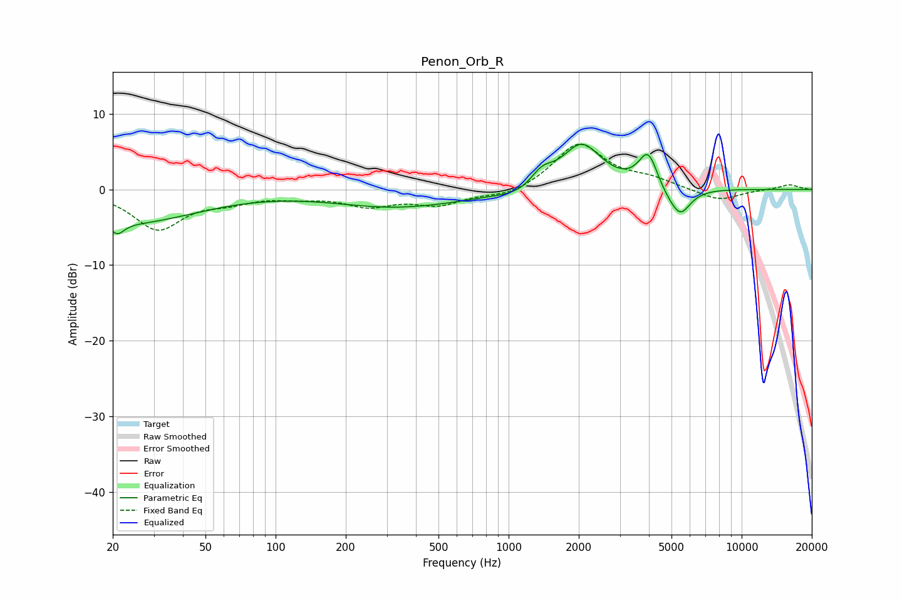

# Penon_Orb_R
See [usage instructions](https://github.com/jaakkopasanen/AutoEq#usage) for more options and info.

### Parametric EQs
Apply preamp of -6.1 dB when using parametric equalizer.

|   # | Type    |   Fc (Hz) |    Q |   Gain (dB) |
|-----|---------|-----------|------|-------------|
|   1 | Peaking |        21 | 4.89 |        -1.6 |
|   2 | Peaking |        24 | 0.48 |        -4.3 |
|   3 | Peaking |       326 | 0.53 |        -2.2 |
|   4 | Peaking |       556 | 1.25 |        -0.1 |
|   5 | Peaking |      1132 | 1.39 |        -1.1 |
|   6 | Peaking |      1386 | 2.86 |         2.1 |
|   7 | Peaking |      2057 | 1.64 |         6   |
|   8 | Peaking |      3975 | 3.38 |         4.9 |
|   9 | Peaking |      4774 | 2.32 |        -1.2 |
|  10 | Peaking |      5455 | 3.15 |        -3.3 |

### Fixed Band EQs
When using fixed band (also called graphic) equalizer, apply preamp of **-6.1 dB** (if available) and set gains manually with these parameters.

|   # | Type    |   Fc (Hz) |    Q |   Gain (dB) |
|-----|---------|-----------|------|-------------|
|   1 | Peaking |        31 | 1.41 |        -5.1 |
|   2 | Peaking |        62 | 1.41 |        -1.2 |
|   3 | Peaking |       125 | 1.41 |        -0.8 |
|   4 | Peaking |       250 | 1.41 |        -1.9 |
|   5 | Peaking |       500 | 1.41 |        -1.9 |
|   6 | Peaking |      1000 | 1.41 |        -1   |
|   7 | Peaking |      2000 | 1.41 |         6.1 |
|   8 | Peaking |      4000 | 1.41 |         1.1 |
|   9 | Peaking |      8000 | 1.41 |        -1.6 |
|  10 | Peaking |     16000 | 1.41 |         0.7 |

### Graphs

