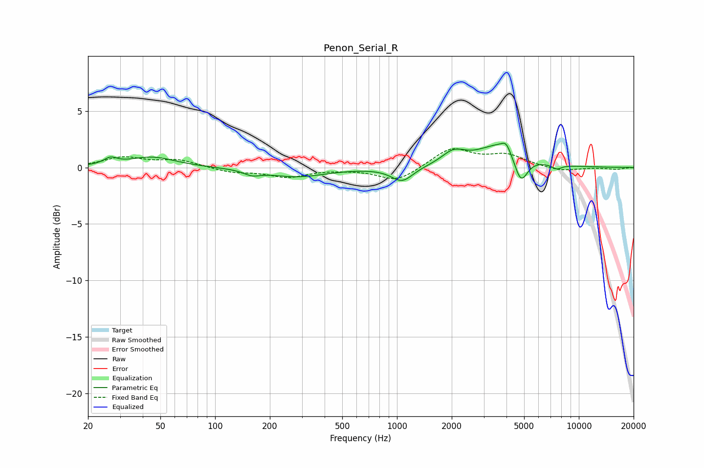

# Penon_Serial_R
See [usage instructions](https://github.com/jaakkopasanen/AutoEq#usage) for more options and info.

### Parametric EQs
Apply preamp of -2.2 dB when using parametric equalizer.

|   # | Type    |   Fc (Hz) |    Q |   Gain (dB) |
|-----|---------|-----------|------|-------------|
|   1 | Peaking |        27 | 3.97 |         0.6 |
|   2 | Peaking |        45 | 1.11 |         0.9 |
|   3 | Peaking |       160 | 3.22 |        -0.4 |
|   4 | Peaking |       280 | 0.86 |        -0.8 |
|   5 | Peaking |      1068 | 2.35 |        -1.3 |
|   6 | Peaking |      2048 | 2.19 |         1.1 |
|   7 | Peaking |      3729 | 1.18 |         2.1 |
|   8 | Peaking |      3986 | 5.78 |         0.7 |
|   9 | Peaking |      4797 | 3.72 |        -2.5 |
|  10 | Peaking |      7565 | 4.84 |        -0.4 |

### Fixed Band EQs
When using fixed band (also called graphic) equalizer, apply preamp of **-1.8 dB** (if available) and set gains manually with these parameters.

|   # | Type    |   Fc (Hz) |    Q |   Gain (dB) |
|-----|---------|-----------|------|-------------|
|   1 | Peaking |        31 | 1.41 |         0.9 |
|   2 | Peaking |        62 | 1.41 |         0.6 |
|   3 | Peaking |       125 | 1.41 |        -0.4 |
|   4 | Peaking |       250 | 1.41 |        -0.8 |
|   5 | Peaking |       500 | 1.41 |        -0.1 |
|   6 | Peaking |      1000 | 1.41 |        -1.2 |
|   7 | Peaking |      2000 | 1.41 |         1.7 |
|   8 | Peaking |      4000 | 1.41 |         1   |
|   9 | Peaking |      8000 | 1.41 |        -0.4 |
|  10 | Peaking |     16000 | 1.41 |        -0.2 |

### Graphs

