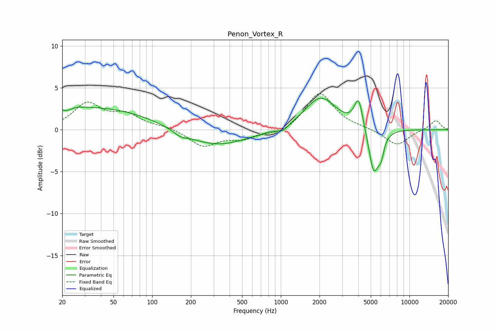

# Penon_Vortex_R
See [usage instructions](https://github.com/jaakkopasanen/AutoEq#usage) for more options and info.

### Parametric EQs
Apply preamp of -3.9 dB when using parametric equalizer.

|   # | Type    |   Fc (Hz) |    Q |   Gain (dB) |
|-----|---------|-----------|------|-------------|
|   1 | Peaking |        20 | 1.64 |         2.2 |
|   2 | Peaking |        21 | 2.59 |        -1.8 |
|   3 | Peaking |        41 | 0.35 |         2.5 |
|   4 | Peaking |       167 | 2.75 |        -0.5 |
|   5 | Peaking |       312 | 0.59 |        -2   |
|   6 | Peaking |      1040 | 3.75 |        -0.6 |
|   7 | Peaking |      2044 | 1.16 |         3.9 |
|   8 | Peaking |      4023 | 4.2  |         3.6 |
|   9 | Peaking |      5275 | 3.52 |        -5.4 |
|  10 | Peaking |      6009 | 6    |        -1.9 |

### Fixed Band EQs
When using fixed band (also called graphic) equalizer, apply preamp of **-4.4 dB** (if available) and set gains manually with these parameters.

|   # | Type    |   Fc (Hz) |    Q |   Gain (dB) |
|-----|---------|-----------|------|-------------|
|   1 | Peaking |        31 | 1.41 |         3   |
|   2 | Peaking |        62 | 1.41 |         1.6 |
|   3 | Peaking |       125 | 1.41 |         0.4 |
|   4 | Peaking |       250 | 1.41 |        -1.9 |
|   5 | Peaking |       500 | 1.41 |        -1   |
|   6 | Peaking |      1000 | 1.41 |        -0.6 |
|   7 | Peaking |      2000 | 1.41 |         4.5 |
|   8 | Peaking |      4000 | 1.41 |         0.2 |
|   9 | Peaking |      8000 | 1.41 |        -1.9 |
|  10 | Peaking |     16000 | 1.41 |         1.2 |

### Graphs

